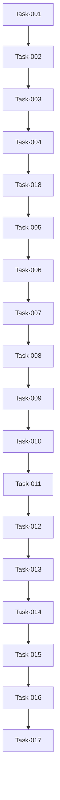

# Project Board

This document answers one question:

> **What needs to be built, what is being built now, and how do we know when each task is finished?**

It tracks development work, task status, acceptance criteria, test cases and delivery progress.

---

# Board Structure

Questions to answer:

- How is work organized?
- Which statuses are used?
- What does each status mean?

Statuses:

- Backlog
- This Sprint
- In Progress
- Review
- Blocked
- On Hold
- Done

---

# Backlog

Tasks that are planned but not currently being worked on.

Questions to answer:

- Which features are not started yet?
- Which tasks are required for the MVP?
- Which tasks are optional or future improvements?

## TASK-001 — Initialize Project Structure and Development Environment

### Status

Backlog

### Goal

Create a stable, clean and repeatable development environment for the project.

The project should be ready for feature development without repository, interpreter, dependency or configuration issues.

### Description

This task includes:

- creating and configuring the Git repository
- creating the local project folder
- adding the initial project documentation
- creating the planned folder and file structure
- creating and activating a Python virtual environment
- adding the initial required dependencies
- preparing environment variable handling
- configuring `.gitignore`
- verifying the Python interpreter and installed packages
- completing the initial commit and push

This task does not include any product feature development.

### Dependencies

None — this is the first implementation task.

### Subtasks

- [ ] Create the GitHub repository.
- [ ] Create the local project folder.
- [ ] Initialize Git and connect the local repository to GitHub.
- [ ] Create `.gitignore`.
- [ ] Ensure `.venv`, `.env`, cache files and local IDE files are excluded from Git.
- [ ] Add the initial project documentation:
  - [ ] `README.md`
  - [ ] `PROJECT_SCOPE.md`
  - [ ] `ARCHITECTURE.md`
  - [ ] `PROJECT_BOARD.md`
  - [ ] `DECISIONS.md`

- [ ] Create the initial planned folder structure.
- [ ] Create the Python virtual environment.
- [ ] Activate the virtual environment.
- [ ] Configure the correct Python interpreter.
- [ ] Create `requirements.txt`.
- [ ] Add only the initial dependencies currently required.
- [ ] Install dependencies from `requirements.txt`.
- [ ] Create `.env.example`.
- [ ] Create a local `.env` file if environment variables are already required.
- [ ] Verify that installed packages can be imported.
- [ ] Commit and push the initial project setup.

### Acceptance Criteria

- [ ] The GitHub repository exists and is connected to the local repository.
- [ ] The initial project folder structure exists.
- [ ] The Python virtual environment can be created and activated.
- [ ] The correct Python interpreter is selected.
- [ ] `pip install -r requirements.txt` completes without errors.
- [ ] Initial package imports complete without errors.
- [ ] The following documents exist:
  - [ ] `README.md`
  - [ ] `PROJECT_SCOPE.md`
  - [ ] `ARCHITECTURE.md`
  - [ ] `PROJECT_BOARD.md`
  - [ ] `DECISIONS.md`

- [ ] `.gitignore` excludes `.venv`, `.env`, cache files and local IDE files.
- [ ] `.env.example` exists.
- [ ] No secrets or local environment files are tracked by Git.
- [ ] The initial commit and push complete successfully.
- [ ] No product feature has been implemented as part of this task.

### Measurements

- `pip install -r requirements.txt` succeeds with zero errors.
- Initial package imports succeed with zero errors.
- `git status` does not show `.venv`, `.env` or other excluded local files.
- Initial commit and push complete without errors.
- All required initial documentation files are present.
- The development environment can be restarted without manual repair.

### Test Cases

- [ ] Activate the virtual environment from a new terminal session.
- [ ] Run `pip install -r requirements.txt`.
- [ ] Import the initial installed packages.
- [ ] Run `git status` and verify that excluded files are not tracked.
- [ ] Verify that `.env.example` is committed and `.env` is not committed.
- [ ] Commit a small documentation change and push it successfully.
- [ ] Close and reopen the project and verify that the correct interpreter can be selected again.

### Notes

Dependencies should be added gradually as they become necessary.

The project should not install speculative packages that are not yet used.

## TASK-002 — Define CV Data Model and Build Initial Streamlit Input Flow

### Status

Backlog

### Goal

This task produces the main CV input for the application.

### Description

The user’s CV will be examined and a decision will be made about which parts should be kept.

The most appropriate CV format will be selected, the approved data will be stored as structured JSON, and the final output of the task will be an initial Streamlit CV page.

### Dependencies

TASK-001 must be completed first.

### Subtasks

- [ ] Review the current CV and agree on which sections and information will be kept.
- [ ] Select an ATS-friendly CV format.
- [ ] Define the structured JSON model for the CV.
- [ ] Create and populate `cv_data/cv_sale.json`.
- [ ] Create a validation model for the CV data.
- [ ] Create the initial Streamlit page.
- [ ] Load the CV data from the JSON file.
- [ ] Render the agreed CV sections on the page.
- [ ] Add basic screen and print styling.
- [ ] Handle a missing or invalid CV data file.
- [ ] Confirm that CV content is not hardcoded inside the Streamlit page.

### Acceptance Criteria

- [ ] CV format selected.
- [ ] User’s CV examined and data selected.
- [ ] CV data stored as structured JSON.
- [ ] Static Streamlit page created.
- [ ] Streamlit page loads the CV from the JSON file.

### Measurements

- Streamlit page exists.
- Page can be launched via terminal.
- Web version of the CV contains the agreed data.
- When saved as PDF, the CV is a maximum of two pages long.

### Test Cases

- [ ] Normal flow — user runs the command via terminal and the webpage loads the complete CV from the JSON file.

### Notes

- This task includes only the first CV profile.
- Svetlana’s CV and profile selection are not included.
- Final PDF styling can be improved in a later task if the document is already readable and usable.

### Goal

This task should produce the necessary technical foundation for the rest of the project.

### Status

Backlog

### Description

The following will be implemented:

- FastAPI backend foundation
- `config.py` containing the main application configuration
- basic logging logic

### Acceptance Criteria

- [ ] `api.py` created and FastAPI application initialized
- [ ] Root endpoint created
- [ ] `logger.py` created
- [ ] Logging added to the root endpoint
- [ ] `config.py` created and imported successfully

### Measurements

- Application starts without import or runtime errors.
- Root endpoint returns the expected response.
- Request to the root endpoint creates the expected log entry.

### Test Cases

- [ ] Normal flow — user starts the FastAPI application from the terminal and the root endpoint returns the expected response.
- [ ] Invalid endpoint — request to an undefined endpoint returns `404 Not Found`.

## TASK-003 — Implement FastAPI Backend Foundation, Configuration and Logging

### Status

Backlog

### Goal

This task should produce the necessary technical foundation for the rest of the project.

### Description

The following will be implemented:

- FastAPI backend foundation
- `config.py` containing the main application configuration
- basic logging logic

### Acceptance Criteria

- [ ] `api.py` created and FastAPI application initialized
- [ ] Root endpoint created
- [ ] `logger.py` created
- [ ] Logging added to the root endpoint
- [ ] `config.py` created and imported successfully

### Measurements

- Application starts without import or runtime errors.
- Root endpoint returns the expected response.
- Request to the root endpoint creates the expected log entry.

### Test Cases

- [ ] Normal flow — user starts the FastAPI application from the terminal and the root endpoint returns the expected response.
- [ ] Invalid endpoint — request to an undefined endpoint returns `404 Not Found`.

## TASK-004 — Define API Request Contracts and Protect Backend Endpoints

### Status

Backlog

### Goal

Ensure the stability and security of the application by standardizing API requests and applying a protective layer.

### Description

With this task, we will define the request contract for each planned protected endpoint.

Furthermore, we will use an API key to protect access to the backend and apply rate limiting to prevent request flooding.

### Dependencies

TASK-003 must be completed first.

### Subtasks

- [ ] Define Pydantic request models for the planned protected endpoints.
- [ ] Add request validation to reject missing or invalid fields.
- [ ] Add API key configuration through environment variables.
- [ ] Create reusable API key authentication logic.
- [ ] Apply API key protection to protected endpoints.
- [ ] Add rate-limiting configuration.
- [ ] Apply rate limiting to protected endpoints.
- [ ] Return structured error responses for authentication, validation and rate-limit failures.
- [ ] Add logging for rejected authentication and rate-limit requests.
- [ ] Confirm that secrets are not hardcoded or committed to Git.

### Acceptance Criteria

- [ ] Each planned protected endpoint has a defined request contract.
- [ ] Requests with an invalid contract are rejected.
- [ ] Protected endpoints require a valid API key.
- [ ] The API key is stored securely through environment variables.
- [ ] The API key is not hardcoded or committed to Git.
- [ ] Rate limiting is applied to protected endpoints.
- [ ] Missing or invalid API keys return an access-denied response.
- [ ] Exceeding the rate limit returns a clear rate-limit response.

### Measurements

- Valid requests are accepted.
- Invalid request payloads are rejected with a validation error.
- Missing or invalid API keys are rejected.
- A valid API key allows access.
- Requests exceeding the configured limit are rejected.
- API secrets do not exist in tracked repository files.

### Test Cases

- [ ] Normal flow — a request with a valid payload and valid API key is accepted.
- [ ] Invalid payload — a request that does not match the request contract is rejected.
- [ ] Missing API key — access is denied.
- [ ] Invalid API key — access is denied.
- [ ] Rate limit exceeded — additional requests are rejected with a rate-limit error.

### Notes

- Root or health-check endpoints may remain unprotected if required for deployment monitoring.
- Exact rate limits will be agreed during technical implementation.

## TASK-005 — Integrate Gemini Client, Prompt Configuration and Retry Logic

### Status

Backlog

### Goal

Integrate Gemini as the AI provider and create a reusable client foundation for future AI workflows.

### Description

The following will be implemented:

- Gemini API client configuration
- model configuration
- prompt instructions
- maximum output token configuration
- request timeout
- retry logic with a maximum of three total attempts
- logging and controlled failure handling

This task only establishes and tests the Gemini integration. CV optimization will be implemented in a later task.

### Dependencies

TASK-018 must be completed first.

### Subtasks

- [ ] Install and configure the current Google GenAI Python SDK.
- [ ] Create `ai/ai_client.py`.
- [ ] Create `ai/prompts.py`.
- [ ] Add the Gemini API key to environment configuration.
- [ ] Add the selected model name to `config.py`.
- [ ] Add maximum output token, timeout and retry settings to `config.py`.
- [ ] Create a reusable function for sending requests to Gemini.
- [ ] Implement retry logic with a maximum of three total attempts.
- [ ] Add handling for API failures, timeouts and empty responses.
- [ ] Log each failed attempt and the final workflow failure.
- [ ] Add a simple test prompt to confirm that the client returns a text response.
- [ ] Confirm that the API key is not hardcoded or committed to Git.

### Acceptance Criteria

- [ ] A suitable Gemini model is selected.
- [ ] `ai/ai_client.py` is created.
- [ ] `ai/prompts.py` is created.
- [ ] Gemini API key is securely stored through environment variables.
- [ ] Model name is configurable.
- [ ] Maximum output tokens are configured.
- [ ] Request timeout is configured.
- [ ] Retry logic allows a maximum of three total attempts.
- [ ] API failures, timeouts and empty responses are handled and logged.
- [ ] Final failure after the third unsuccessful attempt is logged.
- [ ] A successful test request returns a non-empty string.
- [ ] No Gemini secrets are hardcoded or committed to Git.

### Measurements

- The Gemini client runs without import or runtime errors.
- A valid test request returns a non-empty text response.
- A failed request stops after three total attempts.
- Every failed attempt is logged.
- Final failure is returned in a controlled form.
- Gemini credentials do not exist in tracked repository files.

### Test Cases

- [ ] Normal flow — a valid test prompt returns a non-empty string.
- [ ] Timeout — the request times out, retries where appropriate and logs the failure.
- [ ] API failure — Gemini returns an error and the attempt is logged.
- [ ] Empty response — an empty response is treated as a failed attempt.
- [ ] Maximum attempts reached — processing stops after three total unsuccessful attempts and logs the final failure.

### Notes

- Prompt instructions belong in `ai/prompts.py`; technical settings belong in `config.py`.
- This task does not yet generate or validate an optimized CV.
- Model selection should be based on output quality, structured-output support, availability and expected cost.

## TASK-006 — Define Core CV Optimization Response Models, Cleaner and Validation Rules

### Status

Backlog

### Goal

Define the minimum set of response models and validation rules required to ensure the integrity of the generated CV result.

### Description

With this task, we will define the expected JSON response format returned by the AI.

Furthermore, we will define cleaner rules that remove Markdown code fences and surrounding text from the AI response.

Finally, we will define validation rules that check:

- required JSON keys
- data types
- allowed values
- minimum and maximum lengths
- consistency between the fit result and CV output

Company research and interview preparation are not included in this task.

### Dependencies

TASK-005 must be completed first.

### Expected JSON Format

```json
{
  "fit_assessment": {
    "level": "strong",
    "explanation": "Explanation of the candidate's fit.",
    "relevant_experience": [
      "Relevant experience supported by the original CV."
    ],
    "missing_requirements": []
  },
  "cv_patch": {
    "professional_summary": "Optimized professional summary.",
    "experience_updates": [
      {
        "experience_id": "experience_001",
        "suggested_job_title": null,
        "responsibilities": [
          "Optimized responsibility based on existing CV information."
        ]
      }
    ],
    "skills_to_highlight": ["Stakeholder management"]
  },
  "gap_analysis": {
    "supported_requirements": ["Requirement supported by the CV."],
    "reasonably_derived_requirements": [],
    "unsupported_requirements": [
      {
        "requirement": "Unsupported requirement.",
        "impact": "medium",
        "preparation_recommendation": "Recommended preparation.",
        "interview_guidance": "How to discuss the gap honestly."
      }
    ]
  },
  "warnings": []
}
```

For a `poor` fit, `cv_patch` must be `null`.

### Subtasks

- [ ] Define Pydantic models for the core CV optimization response.
- [ ] Define nested models for fit assessment, CV patch and gap analysis.
- [ ] Configure models to reject unexpected fields.
- [ ] Create `ai/cleaner.py`.
- [ ] Remove Markdown JSON fences from AI responses.
- [ ] Extract the JSON object from surrounding AI text.
- [ ] Reject responses that do not contain valid JSON.
- [ ] Create `ai/validation.py`.
- [ ] Validate required keys, data types, enums and field lengths.
- [ ] Validate that referenced experience IDs exist in the original CV.
- [ ] Validate that highlighted skills are supported by the original CV.
- [ ] Enforce the poor-fit rule.
- [ ] Return all validation failure reasons.
- [ ] Log cleaner failures.
- [ ] Log validation failures with the complete list of reasons.

### Acceptance Criteria

- [ ] The JSON response format is defined and locked.
- [ ] `ai/cleaner.py` is created.
- [ ] `ai/validation.py` is created.
- [ ] Cleaner returns pure parsed JSON without Markdown or surrounding text.
- [ ] Cleaner does not invent or repair missing response content.
- [ ] Cleaner failures are logged.
- [ ] Validation failures are logged with all detected reasons.
- [ ] Missing mandatory keys are rejected.
- [ ] Incorrect data types are rejected.
- [ ] Invalid field lengths are rejected.
- [ ] Unsupported enum values are rejected.
- [ ] Unexpected JSON fields are rejected.
- [ ] A `poor` fit requires `cv_patch` to be `null`.
- [ ] A `strong`, `solid` or `stretch` fit requires a valid `cv_patch`.

### Validation Rules

#### `fit_assessment`

- `level`
  - required string
  - allowed values: `strong`, `solid`, `stretch`, `poor`
- `explanation`
  - required string
  - 50–1,000 characters
- `relevant_experience`
  - required list of strings
  - minimum one item
  - each item: 10–500 characters
- `missing_requirements`
  - required list of strings
  - may be empty
  - each item: 5–300 characters

#### `cv_patch`

- required for `strong`, `solid` and `stretch`
- must be `null` for `poor`
- allowed keys:
  - `professional_summary`
  - `experience_updates`
  - `skills_to_highlight`

#### `professional_summary`

- required string
- 80–700 characters

#### `experience_updates`

- required list
- minimum one item
- each item must contain:
  - valid `experience_id`
  - optional `suggested_job_title`
  - `responsibilities`
- each responsibility:
  - 20–400 characters
- maximum six responsibilities per experience entry

#### `skills_to_highlight`

- required list of strings
- minimum one item
- maximum 30 items
- each skill must be supported by the original CV

#### `gap_analysis`

Required keys:

- `supported_requirements`
- `reasonably_derived_requirements`
- `unsupported_requirements`

Each unsupported requirement must contain:

- `requirement`
  - required string
  - minimum 5 characters
- `impact`
  - allowed values: `low`, `medium`, `high`
- `preparation_recommendation`
  - required string
  - minimum 20 characters
- `interview_guidance`
  - required string
  - minimum 20 characters

#### `warnings`

- required list of strings
- may be empty
- each warning: 5–300 characters

### Measurements

- Cleaner returns pure parsed JSON.
- Valid responses pass validation.
- Validation fails when any mandatory rule is not met.
- Validation returns all detected failure reasons.
- Cleaner and validation errors are logged.

### Test Cases

- [ ] Normal flow — a valid raw AI response is cleaned, parsed and validated successfully.
- [ ] Markdown wrapper — valid JSON inside a Markdown code block is extracted successfully.
- [ ] Surrounding text — valid JSON surrounded by AI text is extracted successfully.
- [ ] Missing keys — validation fails and lists the missing keys.
- [ ] Wrong type — validation fails when a field has an incorrect data type.
- [ ] Wrong size — validation fails when a field does not meet length or list-size rules.
- [ ] Invalid enum — validation fails for an unsupported fit level or impact value.
- [ ] Poor-fit violation — validation fails when a poor-fit response contains a CV patch.
- [ ] Cleaner failure — a response without valid JSON is rejected and logged.

### Notes

- The cleaner may remove wrappers and surrounding text, but it must not modify the JSON content.
- Protected CV-field validation will compare the response with the original structured CV.
- Company research and interview preparation models will be added in later tasks.

## TASK-007 — Implement Role Fit and CV Optimization Workflow

### Status

Backlog

### Goal

What should this task achieve and why is it needed?

### Description

What is included in this task?

What is explicitly not included?

### Dependencies

Which tasks or decisions must be completed first?

### Subtasks

- [ ] Subtask 1
- [ ] Subtask 2
- [ ] Subtask 3

### Acceptance Criteria

- [ ] Requirement 1
- [ ] Requirement 2
- [ ] Requirement 3

### Measurements

How will success be measured?

- Metric 1
- Metric 2

### Test Cases

- [ ] Normal flow
- [ ] Invalid input
- [ ] Expected failure
- [ ] Relevant edge case

### Notes

Only include risks, open questions or important implementation constraints.

## TASK-008 — Build CV Results UI, Preview and Browser PDF Export

### Status

Backlog

### Goal

What should this task achieve and why is it needed?

### Description

What is included in this task?

What is explicitly not included?

### Dependencies

Which tasks or decisions must be completed first?

### Subtasks

- [ ] Subtask 1
- [ ] Subtask 2
- [ ] Subtask 3

### Acceptance Criteria

- [ ] Requirement 1
- [ ] Requirement 2
- [ ] Requirement 3

### Measurements

How will success be measured?

- Metric 1
- Metric 2

### Test Cases

- [ ] Normal flow
- [ ] Invalid input
- [ ] Expected failure
- [ ] Relevant edge case

### Notes

Only include risks, open questions or important implementation constraints.

## TASK-009 — Define Section Revision Models and Validation Rules

### Status

Backlog

### Goal

What should this task achieve and why is it needed?

### Description

What is included in this task?

What is explicitly not included?

### Dependencies

Which tasks or decisions must be completed first?

### Subtasks

- [ ] Subtask 1
- [ ] Subtask 2
- [ ] Subtask 3

### Acceptance Criteria

- [ ] Requirement 1
- [ ] Requirement 2
- [ ] Requirement 3

### Measurements

How will success be measured?

- Metric 1
- Metric 2

### Test Cases

- [ ] Normal flow
- [ ] Invalid input
- [ ] Expected failure
- [ ] Relevant edge case

### Notes

Only include risks, open questions or important implementation constraints.

## TASK-010 — Implement Targeted Section Revision Workflow and UI Controls

### Status

Backlog

### Goal

What should this task achieve and why is it needed?

### Description

What is included in this task?

What is explicitly not included?

### Dependencies

Which tasks or decisions must be completed first?

### Subtasks

- [ ] Subtask 1
- [ ] Subtask 2
- [ ] Subtask 3

### Acceptance Criteria

- [ ] Requirement 1
- [ ] Requirement 2
- [ ] Requirement 3

### Measurements

How will success be measured?

- Metric 1
- Metric 2

### Test Cases

- [ ] Normal flow
- [ ] Invalid input
- [ ] Expected failure
- [ ] Relevant edge case

### Notes

Only include risks, open questions or important implementation constraints.

## TASK-011 — Perform Mid-Project Refactoring and Architecture Review

### Status

Backlog

### Goal

What should this task achieve and why is it needed?

### Description

What is included in this task?

What is explicitly not included?

### Dependencies

Which tasks or decisions must be completed first?

### Subtasks

- [ ] Subtask 1
- [ ] Subtask 2
- [ ] Subtask 3

### Acceptance Criteria

- [ ] Requirement 1
- [ ] Requirement 2
- [ ] Requirement 3

### Measurements

How will success be measured?

- Metric 1
- Metric 2

### Test Cases

- [ ] Normal flow
- [ ] Invalid input
- [ ] Expected failure
- [ ] Relevant edge case

### Notes

Only include risks, open questions or important implementation constraints.

## TASK-012 — Implement Company Research and Search Grounding

### Status

Backlog

### Goal

What should this task achieve and why is it needed?

### Description

What is included in this task?

What is explicitly not included?

### Dependencies

Which tasks or decisions must be completed first?

### Subtasks

- [ ] Subtask 1
- [ ] Subtask 2
- [ ] Subtask 3

### Acceptance Criteria

- [ ] Requirement 1
- [ ] Requirement 2
- [ ] Requirement 3

### Measurements

How will success be measured?

- Metric 1
- Metric 2

### Test Cases

- [ ] Normal flow
- [ ] Invalid input
- [ ] Expected failure
- [ ] Relevant edge case

### Notes

Only include risks, open questions or important implementation constraints.

## TASK-013 — Implement Interview Preparation Generation

### Status

Backlog

### Goal

What should this task achieve and why is it needed?

### Description

What is included in this task?

What is explicitly not included?

### Dependencies

Which tasks or decisions must be completed first?

### Subtasks

- [ ] Subtask 1
- [ ] Subtask 2
- [ ] Subtask 3

### Acceptance Criteria

- [ ] Requirement 1
- [ ] Requirement 2
- [ ] Requirement 3

### Measurements

How will success be measured?

- Metric 1
- Metric 2

### Test Cases

- [ ] Normal flow
- [ ] Invalid input
- [ ] Expected failure
- [ ] Relevant edge case

### Notes

Only include risks, open questions or important implementation constraints.

## TASK-014 — Extend Main AI Contract and Integrate Supporting Features

### Status

Backlog

### Goal

What should this task achieve and why is it needed?

### Description

What is included in this task?

What is explicitly not included?

### Dependencies

Which tasks or decisions must be completed first?

### Subtasks

- [ ] Subtask 1
- [ ] Subtask 2
- [ ] Subtask 3

### Acceptance Criteria

- [ ] Requirement 1
- [ ] Requirement 2
- [ ] Requirement 3

### Measurements

How will success be measured?

- Metric 1
- Metric 2

### Test Cases

- [ ] Normal flow
- [ ] Invalid input
- [ ] Expected failure
- [ ] Relevant edge case

### Notes

Only include risks, open questions or important implementation constraints.

## TASK-015 — Test Complete Workflow, Edge Cases and Failure Handling

### Status

Backlog

### Goal

What should this task achieve and why is it needed?

### Description

What is included in this task?

What is explicitly not included?

### Dependencies

Which tasks or decisions must be completed first?

### Subtasks

- [ ] Subtask 1
- [ ] Subtask 2
- [ ] Subtask 3

### Acceptance Criteria

- [ ] Requirement 1
- [ ] Requirement 2
- [ ] Requirement 3

### Measurements

How will success be measured?

- Metric 1
- Metric 2

### Test Cases

- [ ] Normal flow
- [ ] Invalid input
- [ ] Expected failure
- [ ] Relevant edge case

### Notes

Only include risks, open questions or important implementation constraints.

## TASK-016 — Prepare Docker and Production Deployment

### Status

Backlog

### Goal

What should this task achieve and why is it needed?

### Description

What is included in this task?

What is explicitly not included?

### Dependencies

Which tasks or decisions must be completed first?

### Subtasks

- [ ] Subtask 1
- [ ] Subtask 2
- [ ] Subtask 3

### Acceptance Criteria

- [ ] Requirement 1
- [ ] Requirement 2
- [ ] Requirement 3

### Measurements

How will success be measured?

- Metric 1
- Metric 2

### Test Cases

- [ ] Normal flow
- [ ] Invalid input
- [ ] Expected failure
- [ ] Relevant edge case

### Notes

Only include risks, open questions or important implementation constraints.

## TASK-017 — Finalize Documentation and Conduct Project Review

### Status

Backlog

### Goal

What should this task achieve and why is it needed?

### Description

What is included in this task?

What is explicitly not included?

### Dependencies

Which tasks or decisions must be completed first?

### Subtasks

- [ ] Subtask 1
- [ ] Subtask 2
- [ ] Subtask 3

### Acceptance Criteria

- [ ] Requirement 1
- [ ] Requirement 2
- [ ] Requirement 3

### Measurements

How will success be measured?

- Metric 1
- Metric 2

### Test Cases

- [ ] Normal flow
- [ ] Invalid input
- [ ] Expected failure
- [ ] Relevant edge case

### Notes

Only include risks, open questions or important implementation constraints.

## TASK-018 — Firebase persistance for Job application and company research

### Status

Backlog

### Goal

What should this task achieve and why is it needed?

### Description

What is included in this task?

What is explicitly not included?

### Dependencies

Which tasks or decisions must be completed first?

### Subtasks

- [ ] Subtask 1
- [ ] Subtask 2
- [ ] Subtask 3

### Acceptance Criteria

- [ ] Requirement 1
- [ ] Requirement 2
- [ ] Requirement 3

### Measurements

How will success be measured?

- Metric 1
- Metric 2

### Test Cases

- [ ] Normal flow
- [ ] Invalid input
- [ ] Expected failure
- [ ] Relevant edge case

### Notes

Only include risks, open questions or important implementation constraints.

# This Sprint

Tasks selected for the current development cycle.

Questions to answer:

- What are we focusing on now?
- Why were these tasks selected?
- What should be completed before the next review?

# In Progress

Tasks currently being implemented.

Questions to answer:

- What is actively being built?
- Who or what is blocking progress?
- What still needs to be tested?

---

# Review

Tasks that are implemented but not yet accepted.

Questions to answer:

- Does the feature work as expected?
- Are acceptance criteria met?
- Were edge cases tested?
- Is documentation updated?

---

# Blocked

Tasks that cannot continue until something is resolved.

Questions to answer:

- What is blocking the task?
- Who needs to resolve it?
- What decision or dependency is missing?

---

# On Hold

Tasks intentionally paused or postponed.

Questions to answer:

- Why is this task paused?
- What needs to happen before it continues?
- Is this still part of the MVP?

---

# Done

Completed and accepted tasks.

Questions to answer:

- What was delivered?
- What was tested?
- Are there any follow-up tasks?

---

# Task Template

Use this template for every task.

## TASK-XXX — Title

### Status

Backlog

### Goal

What should this task achieve and why is it needed?

### Description

What is included in this task?

What is explicitly not included?

### Dependencies

Which tasks or decisions must be completed first?

### Subtasks

- [ ] Subtask 1
- [ ] Subtask 2
- [ ] Subtask 3

### Acceptance Criteria

- [ ] Requirement 1
- [ ] Requirement 2
- [ ] Requirement 3

### Measurements

How will success be measured?

- Metric 1
- Metric 2

### Test Cases

- [ ] Normal flow
- [ ] Invalid input
- [ ] Expected failure
- [ ] Relevant edge case

### Notes

Only include risks, open questions or important implementation constraints.

# MVP Task List

Questions to answer:

- Which tasks are required before the MVP is complete?
- Which tasks can be postponed?
- Which tasks are critical for demo quality?

---

# Success Metrics

Questions to answer:

- How do we measure whether the project is good enough?
- What should work reliably?
- What would make the demo convincing?

Example:

- The main user flow works end-to-end.
- AI output is validated before display.
- Invalid AI output fails safely.
- User can complete the main workflow without editing code.
- Project can be explained clearly in the README.

---

# Release Checklist

Questions to answer:

- Is the app runnable from a clean setup?
- Is `.env.example` available?
- Are secrets excluded from Git?
- Are main workflows tested?
- Is documentation updated?
- Are screenshots or demo materials ready?

Checklist:

- [ ] App runs locally
- [ ] Main workflow tested
- [ ] Error cases tested
- [ ] README updated
- [ ] Scope updated
- [ ] Architecture updated
- [ ] Decisions updated
- [ ] No secrets committed
- [ ] Demo ready

# Task Diagram


