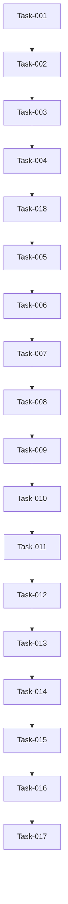

# Project Board

This document answers one question:

> **What needs to be built, what is being built now, and how do we know when each task is finished?**

It tracks development work, task status, acceptance criteria, test cases and delivery progress.

---

# Board Structure

Questions to answer:

- How is work organized?
- Which statuses are used?
- What does each status mean?

Statuses:

- Backlog
- This Sprint
- In Progress
- Review
- Blocked
- On Hold
- Done

---

# Backlog

Tasks that are planned but not currently being worked on.

Questions to answer:

- Which features are not started yet?
- Which tasks are required for the MVP?
- Which tasks are optional or future improvements?

## TASK-007 — Implement Role Fit and CV Optimization Workflow

### Status

Backlog

### Goal

This task implements the first core pillar of the project by building the role-fit and CV optimization logic.

### Description

In this task, we will build the logic to estimate role fit and produce a polished CV in JSON format by using the models, cleaner and validation rules from TASK-006.

### Dependencies

TASK-006 must be completed first.

### Subtasks

- [ ] Define clear prompt instructions for role-fit assessment.
- [ ] Define criteria for the four fit levels: `strong`, `solid`, `stretch` and `poor`.
- [ ] Create the main CV optimization workflow.
- [ ] Load the stored CV profile and job input.
- [ ] Send the required context to Gemini.
- [ ] Pass the AI response through the cleaner.
- [ ] Validate the cleaned response using TASK-006 rules.
- [ ] Stop CV tailoring when the fit level is `poor`.
- [ ] Return a structured poor-fit result with missing requirements and next-step advice.
- [ ] Return a validated CV optimization JSON result when the fit is acceptable.
- [ ] Log workflow start, completion, poor-fit stop and failures.

### Acceptance Criteria

- [ ] Criteria for grading whether the candidate is a good fit are clearly defined.
- [ ] Four role-fit levels are defined: `strong`, `solid`, `stretch` and `poor`.
- [ ] The workflow stops CV tailoring when the fit is `poor`.
- [ ] A poor-fit result returns a clear explanation, missing requirements and advice on next actions.
- [ ] If the fit is acceptable, the workflow produces validated JSON that can later be used to render the CV.
- [ ] AI output passes through the cleaner and validation logic from TASK-006.
- [ ] Invalid AI output is rejected and handled safely.
- [ ] Workflow results and failures are logged.

### Measurements

- The workflow stops CV tailoring when the fit is `poor`.
- A poor-fit result returns structured reasons and next-step advice.
- The workflow produces a polished CV in validated JSON format when the fit is acceptable.
- Invalid AI output does not reach the final workflow result.
- Workflow completion and failure events are logged.

### Test Cases

- [ ] Normal flow — acceptable fit produces a polished CV in validated JSON format.
- [ ] Normal flow — poor fit produces a structured warning and stops CV tailoring.
- [ ] Validation failure — invalid AI output is rejected and logged.
- [ ] Manual quality review — review whether the assigned fit level is reasonable for the provided CV and job ad.

### Notes

- Displaying results in the frontend belongs to a later task.
- Fit quality must be reviewed manually because a structurally valid AI response may still contain a poor assessment.

## TASK-008 — Build CV Results UI, Preview and Browser PDF Export

### Status

Backlog

### Goal

This task completes the CV optimization flow by delivering the final result to the user.

### Description

In this task, we will use the workflow and results from TASK-006 and TASK-007 to build a new web page based on the validated JSON produced by AI.

### Dependencies

TASK-007 must be completed first.

### Subtasks

- [ ] Save the validated application result to Firestore before displaying it to the user with status draft.
- [ ] Create the CV results page.
- [ ] Load the saved application using its `application_id`.
- [ ] Render the CV from the stored JSON.
- [ ] Add a success modal with the message `Your CV is ready`.
- [ ] Add a `Check it now` button that opens the preview in the same tab.
- [ ] Add a `My Applications` page or menu option.
- [ ] Sort saved applications from newest to oldest.
- [ ] Allow the user to reopen a saved application.
- [ ] Add print-friendly styling.
- [ ] Support browser Print / Save as PDF.
- [ ] Add handling for missing, invalid or unavailable application records.

### Acceptance Criteria

- [ ] Before displaying the result to the user, the appropriate record is saved to Firestore with status draft.
- [ ] When the CV is prepared, the user sees a modal with an appropriate success message.
- [ ] Clicking `Check it now` opens the CV preview in the same tab.
- [ ] The preview loads the correct saved application.
- [ ] The user can access previous applications through `My Applications`.
- [ ] The newest application is displayed first.
- [ ] The user can save the CV through browser Print / Save as PDF.
- [ ] The PDF is readable and targets a maximum length of two pages.

### Measurements

- The Firestore record can be verified.
- The success modal appears.
- The `Check it now` button opens the correct preview.
- The user can reopen the application through `My Applications`.
- Saved applications are ordered from newest to oldest.
- The browser PDF is readable.
- The target PDF length is a maximum of two pages.

### Test Cases

- [ ] Normal flow — the user clicks `Check it now`, opens the preview and saves the CV using browser Print / Save as PDF.
- [ ] Normal flow — the user closes the modal and later opens the newest result through `My Applications`.
- [ ] Expected failure — the requested `application_id` does not exist.
- [ ] Expected failure — the stored application record contains invalid data.
- [ ] Expected failure — Firestore cannot load the application record.
- [ ] Manual layout test — the PDF preview exceeds two pages or is not readable.

### Notes

- `My Applications` is a simple saved-results view, not a full history dashboard.
- Final PDF styling may be improved later if the document is already readable and usable.

## TASK-009 — Define Section Revision Models and Validation Rules

### Status

Backlog

### Goal

This task will define the models and validation rules required to revise only the CV sections selected by the user.

### Description

In this task, we will define the request and response formats for section revisions.

The revision response will contain only the selected sections. Each revised section will be validated separately, merged with the existing CV, and the complete merged result will then pass the full validation from TASK-006.

### Dependencies

TASK-008 must be completed first.

### Subtasks

- [ ] Define the revision request model.
- [ ] Define how selected sections and user comments are represented.
- [ ] Define the revision response model.
- [ ] Allow the response to contain only requested sections.
- [ ] Create section-specific validation rules.
- [ ] Reject sections that were not requested.
- [ ] Reject unexpected keys.
- [ ] Validate each revised section before merging.
- [ ] Merge validated revisions with the existing CV.
- [ ] Run complete CV validation after the merge.
- [ ] Return all revision validation failure reasons.
- [ ] Log revision validation and merge failures.

### Acceptance Criteria

- [ ] Revision request and response JSON formats are defined.
- [ ] Each selected section can contain its own user comment.
- [ ] AI response may contain only the requested sections.
- [ ] Additional or unrequested sections are rejected.
- [ ] Each revised section follows its section-specific validation rules.
- [ ] Valid revised sections replace the existing sections.
- [ ] Sections not selected for revision remain unchanged.
- [ ] The complete merged result passes the full TASK-006 validation.
- [ ] Validation failures return and log all detected reasons.

### Measurements

- Only selected sections can be revised.
- Unrequested sections are rejected.
- Invalid revised sections fail validation.
- Unchanged sections remain identical.
- The merged CV passes complete validation.
- All validation errors are logged.

### Test Cases

- [ ] Normal flow — selected sections are validated, merged and pass complete validation.
- [ ] Missing section — the response does not contain one of the requested sections.
- [ ] Additional section — the response contains a section that was not requested.
- [ ] Wrong type — a revised section contains an invalid data type.
- [ ] Wrong size — revised content does not meet its length rules.
- [ ] Merge failure — the merged result fails complete CV validation.

### Notes

- Revision validation is separate from complete CV validation.
- The cleaner may remove wrappers but must not modify revision content.

## TASK-010 — Implement Targeted Revision Workflow and Review UI

### Status

Backlog

### Goal

This task will allow the user to review the generated CV, request changes to selected sections, or accept the CV.

### Description

In this task, a second AI workflow will be developed using separate revision instructions and the user’s comments.

The AI will return only the selected sections. After cleaning and validation, the revised sections will replace the existing sections and the updated CV will remain in draft status until the user accepts it.

### Dependencies

TASK-009 must be completed first.

### Subtasks

- [ ] Add separate revision instructions to `ai/prompts.py`.
- [ ] Display `Request changes` and `Accept CV` buttons on the preview page.
- [ ] Allow comments only on sections that may be revised.
- [ ] Allow each comment to be edited or removed.
- [ ] Add a button to cancel the revision request.
- [ ] Add a `Make changes` button.
- [ ] Build the targeted revision AI call.
- [ ] Send the existing CV, selected sections and user comments to Gemini.
- [ ] Request only the selected sections in the AI response.
- [ ] Pass the response through the cleaner and TASK-009 validation.
- [ ] Merge validated sections with the current CV.
- [ ] Save the revised result as the latest draft version.
- [ ] Keep the CV in `draft` status after revisions.
- [ ] Change the status to `accepted` only after the user clicks `Accept CV`.
- [ ] Enable browser PDF export only for an accepted CV.
- [ ] Log revision requests, completions and failures.

### Acceptance Criteria

- [ ] The initial CV result is available with status `draft`.
- [ ] The preview displays `Request changes` and `Accept CV`.
- [ ] Clicking `Request changes` allows the user to comment only on editable sections.
- [ ] Comments can be edited and removed.
- [ ] The user can cancel the revision process.
- [ ] Clicking `Make changes` starts the targeted revision workflow.
- [ ] AI returns only the selected sections.
- [ ] Revised sections are cleaned, validated and merged.
- [ ] Sections that were not selected remain unchanged.
- [ ] A revised CV is saved as the latest draft version.
- [ ] Clicking `Accept CV` changes the status to `accepted`.
- [ ] PDF export is available only after acceptance.

### Measurements

- Review and acceptance buttons are displayed and work.
- Only editable sections can receive revision comments.
- Comments can be added, edited and removed.
- A successful revision updates only the selected sections.
- Revised results remain in draft status.
- Acceptance updates the Firestore status to `accepted`.
- Accepted CVs can be saved through browser Print / Save as PDF.

### Test Cases

- [ ] Normal flow — the user accepts the CV and the database status changes to `accepted`.
- [ ] Normal flow — the user adds, edits and removes comments on editable sections.
- [ ] Normal flow — the user requests changes and receives an updated draft CV.
- [ ] Normal flow — the user cancels the revision process without changing the CV.
- [ ] Expected failure — AI returns an unrequested section.
- [ ] Expected failure — revision response fails validation.
- [ ] Expected failure — Firestore cannot save the revised draft.
- [ ] Expected failure — PDF export is attempted while the CV is still in draft status.

### Notes

- A revision does not automatically accept the CV.
- The user may repeat the review and revision process before acceptance.
- Full revision history and side-by-side comparison are outside the MVP.

## TASK-011 — Perform Mid-Project Refactoring and Architecture Review

### Status

Backlog

### Goal

What should this task achieve and why is it needed?

### Description

What is included in this task?

What is explicitly not included?

### Dependencies

Which tasks or decisions must be completed first?

### Subtasks

- [ ] Subtask 1
- [ ] Subtask 2
- [ ] Subtask 3

### Acceptance Criteria

- [ ] Requirement 1
- [ ] Requirement 2
- [ ] Requirement 3

### Measurements

How will success be measured?

- Metric 1
- Metric 2

### Test Cases

- [ ] Normal flow
- [ ] Invalid input
- [ ] Expected failure
- [ ] Relevant edge case

### Notes

Only include risks, open questions or important implementation constraints.

## TASK-012 — Implement Company Research and Search Grounding

### Status

Backlog

### Goal

What should this task achieve and why is it needed?

### Description

What is included in this task?

What is explicitly not included?

### Dependencies

Which tasks or decisions must be completed first?

### Subtasks

- [ ] Subtask 1
- [ ] Subtask 2
- [ ] Subtask 3

### Acceptance Criteria

- [ ] Requirement 1
- [ ] Requirement 2
- [ ] Requirement 3

### Measurements

How will success be measured?

- Metric 1
- Metric 2

### Test Cases

- [ ] Normal flow
- [ ] Invalid input
- [ ] Expected failure
- [ ] Relevant edge case

### Notes

Only include risks, open questions or important implementation constraints.

## TASK-013 — Implement Interview Preparation Generation

### Status

Backlog

### Goal

What should this task achieve and why is it needed?

### Description

What is included in this task?

What is explicitly not included?

### Dependencies

Which tasks or decisions must be completed first?

### Subtasks

- [ ] Subtask 1
- [ ] Subtask 2
- [ ] Subtask 3

### Acceptance Criteria

- [ ] Requirement 1
- [ ] Requirement 2
- [ ] Requirement 3

### Measurements

How will success be measured?

- Metric 1
- Metric 2

### Test Cases

- [ ] Normal flow
- [ ] Invalid input
- [ ] Expected failure
- [ ] Relevant edge case

### Notes

Only include risks, open questions or important implementation constraints.

## TASK-014 — Extend Main AI Contract and Integrate Supporting Features

### Status

Backlog

### Goal

What should this task achieve and why is it needed?

### Description

What is included in this task?

What is explicitly not included?

### Dependencies

Which tasks or decisions must be completed first?

### Subtasks

- [ ] Subtask 1
- [ ] Subtask 2
- [ ] Subtask 3

### Acceptance Criteria

- [ ] Requirement 1
- [ ] Requirement 2
- [ ] Requirement 3

### Measurements

How will success be measured?

- Metric 1
- Metric 2

### Test Cases

- [ ] Normal flow
- [ ] Invalid input
- [ ] Expected failure
- [ ] Relevant edge case

### Notes

Only include risks, open questions or important implementation constraints.

## TASK-015 — Test Complete Workflow, Edge Cases and Failure Handling

### Status

Backlog

### Goal

What should this task achieve and why is it needed?

### Description

What is included in this task?

What is explicitly not included?

### Dependencies

Which tasks or decisions must be completed first?

### Subtasks

- [ ] Subtask 1
- [ ] Subtask 2
- [ ] Subtask 3

### Acceptance Criteria

- [ ] Requirement 1
- [ ] Requirement 2
- [ ] Requirement 3

### Measurements

How will success be measured?

- Metric 1
- Metric 2

### Test Cases

- [ ] Normal flow
- [ ] Invalid input
- [ ] Expected failure
- [ ] Relevant edge case

### Notes

Only include risks, open questions or important implementation constraints.

## TASK-016 — Prepare Docker and Production Deployment

### Status

Backlog

### Goal

What should this task achieve and why is it needed?

### Description

What is included in this task?

What is explicitly not included?

### Dependencies

Which tasks or decisions must be completed first?

### Subtasks

- [ ] Subtask 1
- [ ] Subtask 2
- [ ] Subtask 3

### Acceptance Criteria

- [ ] Requirement 1
- [ ] Requirement 2
- [ ] Requirement 3

### Measurements

How will success be measured?

- Metric 1
- Metric 2

### Test Cases

- [ ] Normal flow
- [ ] Invalid input
- [ ] Expected failure
- [ ] Relevant edge case

### Notes

Only include risks, open questions or important implementation constraints.

## TASK-017 — Finalize Documentation and Conduct Project Review

### Status

Backlog

### Goal

What should this task achieve and why is it needed?

### Description

What is included in this task?

What is explicitly not included?

### Dependencies

Which tasks or decisions must be completed first?

### Subtasks

- [ ] Subtask 1
- [ ] Subtask 2
- [ ] Subtask 3

### Acceptance Criteria

- [ ] Requirement 1
- [ ] Requirement 2
- [ ] Requirement 3

### Measurements

How will success be measured?

- Metric 1
- Metric 2

### Test Cases

- [ ] Normal flow
- [ ] Invalid input
- [ ] Expected failure
- [ ] Relevant edge case

### Notes

Only include risks, open questions or important implementation constraints.

# This Sprint

# In Progress

Tasks currently being implemented.

Questions to answer:

- What is actively being built?
- Who or what is blocking progress?
- What still needs to be tested?

## TASK-006 — Define Core CV Optimization Response Models, Cleaner and Validation Rules

### Status

Backlog

### Goal

Define the minimum set of response models and validation rules required to ensure the integrity of the generated CV result.

### Description

With this task, we will define the expected JSON response format returned by the AI.

Furthermore, we will define cleaner rules that remove Markdown code fences and surrounding text from the AI response.

Finally, we will define validation rules that check:

- required JSON keys
- data types
- allowed values
- minimum and maximum lengths
- consistency between the fit result and CV output

Company research and interview preparation are not included in this task.

### Dependencies

TASK-005 must be completed first.

### Expected JSON Format

```json
{
  "fit_assessment": {
    "level": "strong",
    "explanation": "Explanation of the candidate's fit.",
    "relevant_experience": [
      "Relevant experience supported by the original CV."
    ],
    "missing_requirements": []
  },
  "cv_patch": {
    "professional_summary": "Optimized professional summary.",
    "experience_updates": [
      {
        "experience_id": "experience_001",
        "suggested_job_title": null,
        "responsibilities": [
          "Optimized responsibility based on existing CV information."
        ]
      }
    ],
    "skills_to_highlight": ["Stakeholder management"]
  },
  "gap_analysis": {
    "supported_requirements": ["Requirement supported by the CV."],
    "reasonably_derived_requirements": [],
    "unsupported_requirements": [
      {
        "requirement": "Unsupported requirement.",
        "impact": "medium",
        "preparation_recommendation": "Recommended preparation.",
        "interview_guidance": "How to discuss the gap honestly."
      }
    ]
  },
  "warnings": []
}
```

For a `poor` fit, `cv_patch` must be `null`.

### Subtasks

- [ ] Define Pydantic models for the core CV optimization response.
- [ ] Define nested models for fit assessment, CV patch and gap analysis.
- [ ] Configure models to reject unexpected fields.
- [ ] Create `ai/cleaner.py`.
- [ ] Remove Markdown JSON fences from AI responses.
- [ ] Extract the JSON object from surrounding AI text.
- [ ] Reject responses that do not contain valid JSON.
- [ ] Create `ai/validation.py`.
- [ ] Validate required keys, data types, enums and field lengths.
- [ ] Validate that referenced experience IDs exist in the original CV.
- [ ] Validate that highlighted skills are supported by the original CV.
- [ ] Enforce the poor-fit rule.
- [ ] Return all validation failure reasons.
- [ ] Log cleaner failures.
- [ ] Log validation failures with the complete list of reasons.

### Acceptance Criteria

- [ ] The JSON response format is defined and locked.
- [ ] `ai/cleaner.py` is created.
- [ ] `ai/validation.py` is created.
- [ ] Cleaner returns pure parsed JSON without Markdown or surrounding text.
- [ ] Cleaner does not invent or repair missing response content.
- [ ] Cleaner failures are logged.
- [ ] Validation failures are logged with all detected reasons.
- [ ] Missing mandatory keys are rejected.
- [ ] Incorrect data types are rejected.
- [ ] Invalid field lengths are rejected.
- [ ] Unsupported enum values are rejected.
- [ ] Unexpected JSON fields are rejected.
- [ ] A `poor` fit requires `cv_patch` to be `null`.
- [ ] A `strong`, `solid` or `stretch` fit requires a valid `cv_patch`.

### Validation Rules

#### `fit_assessment`

- `level`
  - required string
  - allowed values: `strong`, `solid`, `stretch`, `poor`
- `explanation`
  - required string
  - 50–1,000 characters
- `relevant_experience`
  - required list of strings
  - minimum one item
  - each item: 10–500 characters
- `missing_requirements`
  - required list of strings
  - may be empty
  - each item: 5–300 characters

#### `cv_patch`

- required for `strong`, `solid` and `stretch`
- must be `null` for `poor`
- allowed keys:
  - `professional_summary`
  - `experience_updates`
  - `skills_to_highlight`

#### `professional_summary`

- required string
- 80–700 characters

#### `experience_updates`

- required list
- minimum one item
- each item must contain:
  - valid `experience_id`
  - optional `suggested_job_title`
  - `responsibilities`
- each responsibility:
  - 20–400 characters
- maximum six responsibilities per experience entry

#### `skills_to_highlight`

- required list of strings
- minimum one item
- maximum 30 items
- each skill must be supported by the original CV

#### `gap_analysis`

Required keys:

- `supported_requirements`
- `reasonably_derived_requirements`
- `unsupported_requirements`

Each unsupported requirement must contain:

- `requirement`
  - required string
  - minimum 5 characters
- `impact`
  - allowed values: `low`, `medium`, `high`
- `preparation_recommendation`
  - required string
  - minimum 20 characters
- `interview_guidance`
  - required string
  - minimum 20 characters

#### `warnings`

- required list of strings
- may be empty
- each warning: 5–300 characters

### Measurements

- Cleaner returns pure parsed JSON.
- Valid responses pass validation.
- Validation fails when any mandatory rule is not met.
- Validation returns all detected failure reasons.
- Cleaner and validation errors are logged.

### Test Cases

- [ ] Normal flow — a valid raw AI response is cleaned, parsed and validated successfully.
- [ ] Markdown wrapper — valid JSON inside a Markdown code block is extracted successfully.
- [ ] Surrounding text — valid JSON surrounded by AI text is extracted successfully.
- [ ] Missing keys — validation fails and lists the missing keys.
- [ ] Wrong type — validation fails when a field has an incorrect data type.
- [ ] Wrong size — validation fails when a field does not meet length or list-size rules.
- [ ] Invalid enum — validation fails for an unsupported fit level or impact value.
- [ ] Poor-fit violation — validation fails when a poor-fit response contains a CV patch.
- [ ] Cleaner failure — a response without valid JSON is rejected and logged.

### Notes

- The cleaner may remove wrappers and surrounding text, but it must not modify the JSON content.
- Protected CV-field validation will compare the response with the original structured CV.
- Company research and interview preparation models will be added in later tasks.

---

# Review

Tasks that are implemented but not yet accepted.

Questions to answer:

- Does the feature work as expected?
- Are acceptance criteria met?
- Were edge cases tested?
- Is documentation updated?

---

# Blocked

Tasks that cannot continue until something is resolved.

Questions to answer:

- What is blocking the task?
- Who needs to resolve it?
- What decision or dependency is missing?

---

# On Hold

Tasks intentionally paused or postponed.

Questions to answer:

- Why is this task paused?
- What needs to happen before it continues?
- Is this still part of the MVP?

---

# Done

Completed and accepted tasks.

Questions to answer:

- What was delivered?
- What was tested?
- Are there any follow-up tasks?

## TASK-001 — Initialize Project Structure and Development Environment

### Status

Done

### Goal

Create a stable, clean and repeatable development environment for the project.

The project should be ready for feature development without repository, interpreter, dependency or configuration issues.

### Description

This task includes:

- creating and configuring the Git repository
- creating the local project folder
- adding the initial project documentation
- creating the planned folder and file structure
- creating and activating a Python virtual environment
- adding the initial required dependencies
- preparing environment variable handling
- configuring `.gitignore`
- verifying the Python interpreter and installed packages
- completing the initial commit and push

This task does not include any product feature development.

### Dependencies

None — this is the first implementation task.

### Subtasks

- [x] Create the GitHub repository.
- [x] Create the local project folder.
- [x] Initialize Git and connect the local repository to GitHub.
- [x] Create `.gitignore`.
- [x] Ensure `.venv`, `.env`, cache files and local IDE files are excluded from Git.
- [x] Add the initial project documentation:
  - [x] `README.md`
  - [x] `PROJECT_SCOPE.md`
  - [x] `ARCHITECTURE.md`
  - [x] `PROJECT_BOARD.md`
  - [x] `DECISIONS.md`

- [x] Create the initial planned folder structure.
- [x] Create the Python virtual environment.
- [x] Activate the virtual environment.
- [x] Configure the correct Python interpreter.
- [x] Create `requirements.txt`.
- [x] Add only the initial dependencies currently required.
- [x] Install dependencies from `requirements.txt`.
- [x] Create `.env.example`.
- [?] Create a local `.env` file if environment variables are already required.
- [x] Verify that installed packages can be imported.
- [x] Commit and push the initial project setup.

### Acceptance Criteria

- The GitHub repository exists and is connected to the local repository.
- The initial project folder structure exists.
- The Python virtual environment can be created and activated.
- The correct Python interpreter is selected.
- `pip install -r requirements.txt` completes without errors.
- Initial package imports complete without errors.
- The following documents exist:
  - [ ] `README.md`
  - [ ] `PROJECT_SCOPE.md`
  - [ ] `ARCHITECTURE.md`
  - [ ] `PROJECT_BOARD.md`
  - [ ] `DECISIONS.md`

- `.gitignore` excludes `.venv`, `.env`, cache files and local IDE files.
- `.env.example` exists.
- No secrets or local environment files are tracked by Git.
- The initial commit and push complete successfully.
- No product feature has been implemented as part of this task.

### Measurements

- `pip install -r requirements.txt` succeeds with zero errors.
- Initial package imports succeed with zero errors.
- `git status` does not show `.venv`, `.env` or other excluded local files.
- Initial commit and push complete without errors.
- All required initial documentation files are present.
- The development environment can be restarted without manual repair.

### Test Cases

- [x] Activate the virtual environment from a new terminal session.
- [x] Run `pip install -r requirements.txt`.
- [x] Import the initial installed packages.
- [x] Run `git status` and verify that excluded files are not tracked.
- [x] Verify that `.env.example` is committed and `.env` is not committed.
- [x] Commit a small documentation change and push it successfully.
- [x] Close and reopen the project and verify that the correct interpreter can be selected again.

### Notes

Dependencies should be added gradually as they become necessary.

The project should not install speculative packages that are not yet used.

## TASK-002 — Define CV Data Model and Build Initial Streamlit Input Flow

### Status

Done

### Goal

This task produces the main CV input for the application.

### Description

The user’s CV will be examined and a decision will be made about which parts should be kept.

The most appropriate CV format will be selected, the approved data will be stored as structured JSON, and the final output of the task will be an initial Streamlit CV page.

### Dependencies

TASK-001 must be completed first.

### Subtasks

- [x] Review the current CV and agree on which sections and information will be kept.
- [x] Select an ATS-friendly CV format.
- [x] Define the structured JSON model for the CV.
- [x] Create and populate `cv_data/cv_sale.json`.
- [x] Create a validation model for the CV data.
- [x] Create the initial Streamlit page.
- [x] Load the CV data from the JSON file.
- [x] Render the agreed CV sections on the page.
- [x] Add basic screen and print styling.
- [x] Handle a missing or invalid CV data file.
- [x] Confirm that CV content is not hardcoded inside the Streamlit page.

### Acceptance Criteria

- [ ] CV format selected.
- [ ] User’s CV examined and data selected.
- [ ] CV data stored as structured JSON.
- [ ] Static Streamlit page created.
- [ ] Streamlit page loads the CV from the JSON file.

### Measurements

- Streamlit page exists.
- Page can be launched via terminal.
- Web version of the CV contains the agreed data.
- When saved as PDF, the CV is a maximum of two pages long.

### Test Cases

- [x] Normal flow — user runs the command via terminal and the webpage loads the complete CV from the JSON file.

### Notes

- This task includes only the first CV profile.
- Svetlana’s CV and profile selection are not included.
- Final PDF styling can be improved in a later task if the document is already readable and usable.

## TASK-003 — Implement FastAPI Backend Foundation, Configuration and Logging

### Status

Done

### Goal

This task should produce the necessary technical foundation for the rest of the project.

### Description

The following will be implemented:

- FastAPI backend foundation
- `config.py` containing the main application configuration
- basic logging logic
- root endpoint for confirming that the backend is running

### Dependencies

TASK-002 must be completed first.

### Subtasks

- [x] **3.1** Add FastAPI and Uvicorn to `requirements.txt` and install them.
- [x] **3.2** Create `config.py` with the initial application settings.
- [x] **3.3** Create `logger.py` and configure basic application logging.
- [x] **3.4** Initialize the FastAPI application in `api.py`.
- [x] **3.5** Create the root endpoint.
- [x] **3.6** Add logging to application startup and the root endpoint.
- [x] **3.7** Confirm that `config.py` and `logger.py` can be imported successfully.
- [x] **3.8** Run the backend and complete the defined test cases.

### Acceptance Criteria

- [ ] `api.py` is created and the FastAPI application is initialized.
- [ ] Root endpoint is created.
- [ ] `config.py` is created and imported successfully.
- [ ] `logger.py` is created and imported successfully.
- [ ] Application startup is logged.
- [ ] Requests to the root endpoint are logged.
- [ ] The backend starts without import or runtime errors.
- [ ] Undefined endpoints return `404 Not Found`.

### Measurements

- Application starts without import or runtime errors.
- Root endpoint returns the expected response.
- Request to the root endpoint creates the expected log entry.
- Application startup creates the expected log entry.
- Invalid endpoint returns `404 Not Found`.

### Test Cases

- [x] Normal flow — user starts the FastAPI application from the terminal and the root endpoint returns the expected response.
- [x] Normal flow — application startup and root request are logged.
- [x] Invalid endpoint — request to an undefined endpoint returns `404 Not Found`.
- [x] Import test — `config.py`, `logger.py` and `api.py` import without errors.

### Notes

- API authentication, request contracts and rate limiting belong to TASK-004.
- Advanced logging configuration and external monitoring are outside this task.

## TASK-004 — Define API Request Contracts and Protect Backend Endpoints

### Status

Done

### Goal

Ensure the stability and security of the application by standardizing API requests and applying a protective layer.

### Description

With this task, we will define the request contract for each planned protected endpoint.

Furthermore, we will use an API key to protect access to the backend and apply rate limiting to prevent request flooding.

### Dependencies

TASK-003 must be completed first.

### Subtasks

- [x] Define Pydantic request models for the planned protected endpoints.
- [x] Add request validation to reject missing or invalid fields.
- [x] Add API key configuration through environment variables.
- [x] Create reusable API key authentication logic.
- [x] Apply API key protection to protected endpoints.
- [x] Add rate-limiting configuration.
- [x] Apply rate limiting to protected endpoints.
- [x] Return structured error responses for authentication, validation and rate-limit failures.
- [x] Add logging for rejected authentication and rate-limit requests.
- [x] Confirm that secrets are not hardcoded or committed to Git.

### Acceptance Criteria

- [ ] Each planned protected endpoint has a defined request contract.
- [ ] Requests with an invalid contract are rejected.
- [ ] Protected endpoints require a valid API key.
- [ ] The API key is stored securely through environment variables.
- [ ] The API key is not hardcoded or committed to Git.
- [ ] Rate limiting is applied to protected endpoints.
- [ ] Missing or invalid API keys return an access-denied response.
- [ ] Exceeding the rate limit returns a clear rate-limit response.

### Measurements

- Valid requests are accepted.
- Invalid request payloads are rejected with a validation error.
- Missing or invalid API keys are rejected.
- A valid API key allows access.
- Requests exceeding the configured limit are rejected.
- API secrets do not exist in tracked repository files.

### Test Cases

- [ ] Normal flow — a request with a valid payload and valid API key is accepted.
- [ ] Invalid payload — a request that does not match the request contract is rejected.
- [ ] Missing API key — access is denied.
- [ ] Invalid API key — access is denied.
- [ ] Rate limit exceeded — additional requests are rejected with a rate-limit error.

### Notes

- Root or health-check endpoints may remain unprotected if required for deployment monitoring.
- Exact rate limits will be agreed during technical implementation.

## TASK-018 — Implement Firebase Persistence for Job Applications and Company Research

### Status

Done

### Goal

This task will allow us to save and read polished CV results and company information in Firebase.

### Description

In this task, we will define the logic for saving and reading CV application results and company information in Firebase, making them accessible later and avoiding additional workflow runs when reusable data already exists.

### Dependencies

TASK-004 must be completed first.

### Subtasks

- [x] Create and configure a Firebase project with Firestore enabled.
- [x] Configure Firebase Admin SDK credentials for backend access.
- [x] Store credentials in the repository which is not commited and load their location through environment configuration.
- [x] Create `firebase.py`.
- [x] Initialize the Firestore client.
- [x] Create `firebase.py`.
- [x] Create storage logic for the `companies` collection.
- [x] Create storage logic for the `applications` collection.
- [x] Add functions for saving and reading company records.
- [x] Add functions for saving and reading application records.
- [x] Use the normalized company key as the company document ID.
- [x] Generate a unique ID for each application record.
- [x] Add creation and update timestamps.
- [x] Use `Europe/Amsterdam` when displaying stored timestamps.
- [x] Validate records before saving and after reading.
- [x] Implement timeout handling.
- [x] Implement a maximum of three total attempts for retryable failures.
- [x] Log important read, write, retry and failure events.
- [x] Confirm that Firebase credentials are not committed to Git.

### Acceptance Criteria

- [ ] A Firebase project with Firestore is created.
- [ ] `firebase.py` is created.
- [ ] Backend credentials are configured securely and are not stored in the repository.
- [ ] Firestore contains the `companies` and `applications` collections.
- [ ] Company information can be saved and read using a normalized company key.
- [ ] Application results can be saved and read using a unique application ID.
- [ ] Existing company records are reused instead of creating duplicates.
- [ ] Records contain creation and update timestamps.
- [ ] Stored timestamps can be displayed using the `Europe/Amsterdam` timezone.
- [ ] Invalid records are rejected.
- [ ] Stored records are validated before reuse.
- [ ] Timeout errors are handled.
- [ ] Retryable failures allow a maximum of three total attempts.
- [ ] Important operations and failures are logged.

### Measurements

- Firebase credentials are configured securely and are not committed.
- A company record can be saved and read successfully.
- An application record can be saved and read successfully.
- Each application record has a unique ID.
- Existing companies are not duplicated.
- Timeout and retry errors are handled and logged.
- Stored timestamps are displayed in the Amsterdam timezone.

### Test Cases

- [x] Normal flow — a company record is saved and successfully read using its company key.
- [x] Normal flow — an application record is saved with a unique ID and successfully read.
- [x] Invalid input — a record missing mandatory fields is rejected.
- [x] Expected failure — missing or invalid Firebase credentials produce a controlled and logged error.
- [x] Expected failure — a timeout or retryable connection failure stops after three total attempts and is logged.
- [x] Expected failure — reading a nonexistent document returns a controlled not-found result.
- [x] Relevant edge case — an existing company record is reused instead of creating a duplicate.
- [x] Relevant edge case — malformed stored data is rejected before reuse.

### Notes

- Firestore access must only go through the FastAPI backend.
- The Streamlit frontend must not access Firestore directly.
- The MVP does not include user accounts.
- Credentials must not be stored in a committed `secrets` folder.

## TASK-005 — Integrate Gemini Client, Prompt Configuration and Retry Logic

### Status

Done

### Goal

Integrate Gemini as the AI provider and create a reusable client foundation for future AI workflows.

### Description

The following will be implemented:

- Gemini API client configuration
- model configuration
- prompt instructions
- maximum output token configuration
- request timeout
- retry logic with a maximum of three total attempts
- logging and controlled failure handling

This task only establishes and tests the Gemini integration. CV optimization will be implemented in a later task.

### Dependencies

TASK-018 must be completed first.

### Subtasks

- [x] Install and configure the current Google GenAI Python SDK.
- [x] Create `ai/ai_client.py`.
- [x] Create `ai/prompts.py`.
- [x] Add the Gemini API key to environment configuration.
- [x] Add the selected model name to `config.py`.
- [x] Add maximum output token, timeout and retry settings to `config.py`.
- [x] Create a reusable function for sending requests to Gemini.
- [x] Implement retry logic with a maximum of three total attempts.
- [x] Add handling for API failures, timeouts and empty responses.
- [x] Log each failed attempt and the final workflow failure.
- [x] Add a simple test prompt to confirm that the client returns a text response.
- [x] Confirm that the API key is not hardcoded or committed to Git.

### Acceptance Criteria

- [ ] A suitable Gemini model is selected.
- [ ] `ai/ai_client.py` is created.
- [ ] `ai/prompts.py` is created.
- [ ] Gemini API key is securely stored through environment variables.
- [ ] Model name is configurable.
- [ ] Maximum output tokens are configured.
- [ ] Request timeout is configured.
- [ ] Retry logic allows a maximum of three total attempts.
- [ ] API failures, timeouts and empty responses are handled and logged.
- [ ] Final failure after the third unsuccessful attempt is logged.
- [ ] A successful test request returns a non-empty string.
- [ ] No Gemini secrets are hardcoded or committed to Git.

### Measurements

- The Gemini client runs without import or runtime errors.
- A valid test request returns a non-empty text response.
- A failed request stops after three total attempts.
- Every failed attempt is logged.
- Final failure is returned in a controlled form.
- Gemini credentials do not exist in tracked repository files.

### Test Cases

- [x] Normal flow — a valid test prompt returns a non-empty string.
- [x] Timeout — the request times out, retries where appropriate and logs the failure.
- [x] API failure — Gemini returns an error and the attempt is logged.
- [x] Empty response — an empty response is treated as a failed attempt.
- [x] Maximum attempts reached — processing stops after three total unsuccessful attempts and logs the final failure.

### Notes

- Prompt instructions belong in `ai/prompts.py`; technical settings belong in `config.py`.
- This task does not yet generate or validate an optimized CV.
- Model selection should be based on output quality, structured-output support, availability and expected cost.

---

# Task Template

Use this template for every task.

## TASK-XXX — Title

### Status

Backlog

### Goal

What should this task achieve and why is it needed?

### Description

What is included in this task?

What is explicitly not included?

### Dependencies

Which tasks or decisions must be completed first?

### Subtasks

- [ ] Subtask 1
- [ ] Subtask 2
- [ ] Subtask 3

### Acceptance Criteria

- [ ] Requirement 1
- [ ] Requirement 2
- [ ] Requirement 3

### Measurements

How will success be measured?

- Metric 1
- Metric 2

### Test Cases

- [ ] Normal flow
- [ ] Invalid input
- [ ] Expected failure
- [ ] Relevant edge case

### Notes

Only include risks, open questions or important implementation constraints.

# MVP Task List

Questions to answer:

- Which tasks are required before the MVP is complete?
- Which tasks can be postponed?
- Which tasks are critical for demo quality?

---

# Success Metrics

Questions to answer:

- How do we measure whether the project is good enough?
- What should work reliably?
- What would make the demo convincing?

Example:

- The main user flow works end-to-end.
- AI output is validated before display.
- Invalid AI output fails safely.
- User can complete the main workflow without editing code.
- Project can be explained clearly in the README.

---

# Release Checklist

Questions to answer:

- Is the app runnable from a clean setup?
- Is `.env.example` available?
- Are secrets excluded from Git?
- Are main workflows tested?
- Is documentation updated?
- Are screenshots or demo materials ready?

Checklist:

- [ ] App runs locally
- [ ] Main workflow tested
- [ ] Error cases tested
- [ ] README updated
- [ ] Scope updated
- [ ] Architecture updated
- [ ] Decisions updated
- [ ] No secrets committed
- [ ] Demo ready

# Task Diagram


