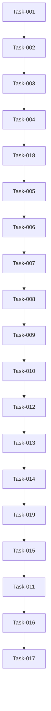

# Project Board

This document answers one question:

> **What needs to be built, what is being built now, and how do we know when each task is finished?**

It tracks development work, task status, acceptance criteria, test cases and delivery progress.

---

# Board Structure

Questions to answer:

- How is work organized?
- Which statuses are used?
- What does each status mean?

Statuses:

- Backlog
- This Sprint
- In Progress
- Review
- Blocked
- On Hold
- Done

---

# Backlog

Tasks that are planned but not currently being worked on.

Questions to answer:

- Which features are not started yet?
- Which tasks are required for the MVP?
- Which tasks are optional or future improvements?

# This Sprint

# In Progress

Tasks currently being implemented.

Questions to answer:

- What is actively being built?
- Who or what is blocking progress?
- What still needs to be tested?

---

# Review

Tasks that are implemented but not yet accepted.

Questions to answer:

- Does the feature work as expected?
- Are acceptance criteria met?
- Were edge cases tested?
- Is documentation updated?

---

# Blocked

Tasks that cannot continue until something is resolved.

Questions to answer:

- What is blocking the task?
- Who needs to resolve it?
- What decision or dependency is missing?

---

# On Hold

Tasks intentionally paused or postponed.

Questions to answer:

- Why is this task paused?
- What needs to happen before it continues?
- Is this still part of the MVP?

---

# Done

Completed and accepted tasks.

Questions to answer:

- What was delivered?
- What was tested?
- Are there any follow-up tasks?

## TASK-001 — Initialize Project Structure and Development Environment

### Status

Done

### Goal

Create a stable, clean and repeatable development environment for the project.

The project should be ready for feature development without repository, interpreter, dependency or configuration issues.

### Description

This task includes:

- creating and configuring the Git repository
- creating the local project folder
- adding the initial project documentation
- creating the planned folder and file structure
- creating and activating a Python virtual environment
- adding the initial required dependencies
- preparing environment variable handling
- configuring `.gitignore`
- verifying the Python interpreter and installed packages
- completing the initial commit and push

This task does not include any product feature development.

### Dependencies

None — this is the first implementation task.

### Subtasks

- [x] Create the GitHub repository.
- [x] Create the local project folder.
- [x] Initialize Git and connect the local repository to GitHub.
- [x] Create `.gitignore`.
- [x] Ensure `.venv`, `.env`, cache files and local IDE files are excluded from Git.
- [x] Add the initial project documentation:
  - [x] `README.md`
  - [x] `PROJECT_SCOPE.md`
  - [x] `ARCHITECTURE.md`
  - [x] `PROJECT_BOARD.md`
  - [x] `DECISIONS.md`

- [x] Create the initial planned folder structure.
- [x] Create the Python virtual environment.
- [x] Activate the virtual environment.
- [x] Configure the correct Python interpreter.
- [x] Create `requirements.txt`.
- [x] Add only the initial dependencies currently required.
- [x] Install dependencies from `requirements.txt`.
- [x] Create `.env.example`.
- [x] Create a local `.env` file if environment variables are already required.
- [x] Verify that installed packages can be imported.
- [x] Commit and push the initial project setup.

### Acceptance Criteria

- The GitHub repository exists and is connected to the local repository.
- The initial project folder structure exists.
- The Python virtual environment can be created and activated.
- The correct Python interpreter is selected.
- `pip install -r requirements.txt` completes without errors.
- Initial package imports complete without errors.
- The following documents exist:
  - [x] `README.md`
  - [x] `PROJECT_SCOPE.md`
  - [x] `ARCHITECTURE.md`
  - [x] `PROJECT_BOARD.md`
  - [x] `DECISIONS.md`

- `.gitignore` excludes `.venv`, `.env`, cache files and local IDE files.
- `.env.example` exists.
- No secrets or local environment files are tracked by Git.
- The initial commit and push complete successfully.
- No product feature has been implemented as part of this task.

### Measurements

- `pip install -r requirements.txt` succeeds with zero errors.
- Initial package imports succeed with zero errors.
- `git status` does not show `.venv`, `.env` or other excluded local files.
- Initial commit and push complete without errors.
- All required initial documentation files are present.
- The development environment can be restarted without manual repair.

### Test Cases

- [x] Activate the virtual environment from a new terminal session.
- [x] Run `pip install -r requirements.txt`.
- [x] Import the initial installed packages.
- [x] Run `git status` and verify that excluded files are not tracked.
- [x] Verify that `.env.example` is committed and `.env` is not committed.
- [x] Commit a small documentation change and push it successfully.
- [x] Close and reopen the project and verify that the correct interpreter can be selected again.

### Notes

Dependencies should be added gradually as they become necessary.

The project should not install speculative packages that are not yet used.

## TASK-002 — Define CV Data Model and Build Initial Streamlit Input Flow

### Status

Done

### Goal

This task produces the main CV input for the application.

### Description

The user’s CV will be examined and a decision will be made about which parts should be kept.

The most appropriate CV format will be selected, the approved data will be stored as structured JSON, and the final output of the task will be an initial Streamlit CV page.

### Dependencies

TASK-001 must be completed first.

### Subtasks

- [x] Review the current CV and agree on which sections and information will be kept.
- [x] Select an ATS-friendly CV format.
- [x] Define the structured JSON model for the CV.
- [x] Create and populate `cv_data/cv_sale.json`.
- [x] Create a validation model for the CV data.
- [x] Create the initial Streamlit page.
- [x] Load the CV data from the JSON file.
- [x] Render the agreed CV sections on the page.
- [x] Add basic screen and print styling.
- [x] Handle a missing or invalid CV data file.
- [x] Confirm that CV content is not hardcoded inside the Streamlit page.

### Acceptance Criteria

- [x] CV format selected.
- [x] User’s CV examined and data selected.
- [x] CV data stored as structured JSON.
- [x] Static Streamlit page created.
- [x] Streamlit page loads the CV from the JSON file.

### Measurements

- Streamlit page exists.
- Page can be launched via terminal.
- Web version of the CV contains the agreed data.
- When saved as PDF, the CV is a maximum of two pages long.

### Test Cases

- [x] Normal flow — user runs the command via terminal and the webpage loads the complete CV from the JSON file.

### Notes

- This task includes only the first CV profile.
- Svetlana’s CV and profile selection are not included.
- Final PDF styling can be improved in a later task if the document is already readable and usable.

## TASK-003 — Implement FastAPI Backend Foundation, Configuration and Logging

### Status

Done

### Goal

This task should produce the necessary technical foundation for the rest of the project.

### Description

The following will be implemented:

- FastAPI backend foundation
- `config.py` containing the main application configuration
- basic logging logic
- root endpoint for confirming that the backend is running

### Dependencies

TASK-002 must be completed first.

### Subtasks

- [x] **3.1** Add FastAPI and Uvicorn to `requirements.txt` and install them.
- [x] **3.2** Create `config.py` with the initial application settings.
- [x] **3.3** Create `logger.py` and configure basic application logging.
- [x] **3.4** Initialize the FastAPI application in `api.py`.
- [x] **3.5** Create the root endpoint.
- [x] **3.6** Add logging to application startup and the root endpoint.
- [x] **3.7** Confirm that `config.py` and `logger.py` can be imported successfully.
- [x] **3.8** Run the backend and complete the defined test cases.

### Acceptance Criteria

- [x] `api.py` is created and the FastAPI application is initialized.
- [x] Root endpoint is created.
- [x] `config.py` is created and imported successfully.
- [x] `logger.py` is created and imported successfully.
- [x] Application startup is logged.
- [x] Requests to the root endpoint are logged.
- [x] The backend starts without import or runtime errors.
- [x] Undefined endpoints return `404 Not Found`.

### Measurements

- Application starts without import or runtime errors.
- Root endpoint returns the expected response.
- Request to the root endpoint creates the expected log entry.
- Application startup creates the expected log entry.
- Invalid endpoint returns `404 Not Found`.

### Test Cases

- [x] Normal flow — user starts the FastAPI application from the terminal and the root endpoint returns the expected response.
- [x] Normal flow — application startup and root request are logged.
- [x] Invalid endpoint — request to an undefined endpoint returns `404 Not Found`.
- [x] Import test — `config.py`, `logger.py` and `api.py` import without errors.

### Notes

- API authentication, request contracts and rate limiting belong to TASK-004.
- Advanced logging configuration and external monitoring are outside this task.

## TASK-004 — Define API Request Contracts and Protect Backend Endpoints

### Status

Done

### Goal

Ensure the stability and security of the application by standardizing API requests and applying a protective layer.

### Description

With this task, we will define the request contract for each planned protected endpoint.

Furthermore, we will use an API key to protect access to the backend and apply rate limiting to prevent request flooding.

### Dependencies

TASK-003 must be completed first.

### Subtasks

- [x] Define Pydantic request models for the planned protected endpoints.
- [x] Add request validation to reject missing or invalid fields.
- [x] Add API key configuration through environment variables.
- [x] Create reusable API key authentication logic.
- [x] Apply API key protection to protected endpoints.
- [x] Add rate-limiting configuration.
- [x] Apply rate limiting to protected endpoints.
- [x] Return structured error responses for authentication, validation and rate-limit failures.
- [x] Add logging for rejected authentication and rate-limit requests.
- [x] Confirm that secrets are not hardcoded or committed to Git.

### Acceptance Criteria

- [x] Each planned protected endpoint has a defined request contract.
- [x] Requests with an invalid contract are rejected.
- [x] Protected endpoints require a valid API key.
- [x] The API key is stored securely through environment variables.
- [x] The API key is not hardcoded or committed to Git.
- [x] Rate limiting is applied to protected endpoints.
- [x] Missing or invalid API keys return an access-denied response.
- [x] Exceeding the rate limit returns a clear rate-limit response.

### Measurements

- Valid requests are accepted.
- Invalid request payloads are rejected with a validation error.
- Missing or invalid API keys are rejected.
- A valid API key allows access.
- Requests exceeding the configured limit are rejected.
- API secrets do not exist in tracked repository files.

### Test Cases

- [x] Normal flow — a request with a valid payload and valid API key is accepted.
- [x] Invalid payload — a request that does not match the request contract is rejected.
- [x] Missing API key — access is denied.
- [x] Invalid API key — access is denied.
- [x] Rate limit exceeded — additional requests are rejected with a rate-limit error.

### Notes

- Root or health-check endpoints may remain unprotected if required for deployment monitoring.
- Exact rate limits will be agreed during technical implementation.

## TASK-018 — Implement Firebase Persistence for Job Applications and Company Research

### Status

Done

### Goal

This task will allow us to save and read polished CV results and company information in Firebase.

### Description

In this task, we will define the logic for saving and reading CV application results and company information in Firebase, making them accessible later and avoiding additional workflow runs when reusable data already exists.

### Dependencies

TASK-004 must be completed first.

### Subtasks

- [x] Create and configure a Firebase project with Firestore enabled.
- [x] Configure Firebase Admin SDK credentials for backend access.
- [x] Store credentials in the repository which is not commited and load their location through environment configuration.
- [x] Create `firebase.py`.
- [x] Initialize the Firestore client.
- [x] Create `firebase.py`.
- [x] Create storage logic for the `companies` collection.
- [x] Create storage logic for the `applications` collection.
- [x] Add functions for saving and reading company records.
- [x] Add functions for saving and reading application records.
- [x] Use the normalized company key as the company document ID.
- [x] Generate a unique ID for each application record.
- [x] Add creation and update timestamps.
- [x] Use `Europe/Amsterdam` when displaying stored timestamps.
- [x] Validate records before saving and after reading.
- [x] Implement timeout handling.
- [x] Implement a maximum of three total attempts for retryable failures.
- [x] Log important read, write, retry and failure events.
- [x] Confirm that Firebase credentials are not committed to Git.

### Acceptance Criteria

- [x] A Firebase project with Firestore is created.
- [x] `firebase.py` is created.
- [x] Backend credentials are configured securely and are not stored in the repository.
- [x] Firestore contains the `companies` and `applications` collections.
- [x] Company information can be saved and read using a normalized company key.
- [x] Application results can be saved and read using a unique application ID.
- [x] Existing company records are reused instead of creating duplicates.
- [x] Records contain creation and update timestamps.
- [x] Stored timestamps can be displayed using the `Europe/Amsterdam` timezone.
- [x] Invalid records are rejected.
- [x] Stored records are validated before reuse.
- [x] Timeout errors are handled.
- [x] Retryable failures allow a maximum of three total attempts.
- [x] Important operations and failures are logged.

### Measurements

- Firebase credentials are configured securely and are not committed.
- A company record can be saved and read successfully.
- An application record can be saved and read successfully.
- Each application record has a unique ID.
- Existing companies are not duplicated.
- Timeout and retry errors are handled and logged.
- Stored timestamps are displayed in the Amsterdam timezone.

### Test Cases

- [x] Normal flow — a company record is saved and successfully read using its company key.
- [x] Normal flow — an application record is saved with a unique ID and successfully read.
- [x] Invalid input — a record missing mandatory fields is rejected.
- [x] Expected failure — missing or invalid Firebase credentials produce a controlled and logged error.
- [x] Expected failure — a timeout or retryable connection failure stops after three total attempts and is logged.
- [x] Expected failure — reading a nonexistent document returns a controlled not-found result.
- [x] Relevant edge case — an existing company record is reused instead of creating a duplicate.
- [x] Relevant edge case — malformed stored data is rejected before reuse.

### Notes

- Firestore access goes through the storage and service layers.
- The final Streamlit flow calls the service layer directly; FastAPI can reuse the same services when used as an API entry point.
- The MVP does not include user accounts.
- Credentials must not be stored in a committed `secrets` folder.

## TASK-005 — Integrate Gemini Client, Prompt Configuration and Retry Logic

### Status

Done

### Goal

Integrate Gemini as the AI provider and create a reusable client foundation for future AI workflows.

### Description

The following will be implemented:

- Gemini API client configuration
- model configuration
- prompt instructions
- maximum output token configuration
- request timeout
- retry logic with a maximum of three total attempts
- logging and controlled failure handling

This task only establishes and tests the Gemini integration. CV optimization will be implemented in a later task.

### Dependencies

TASK-018 must be completed first.

### Subtasks

- [x] Install and configure the current Google GenAI Python SDK.
- [x] Create `ai/ai_client.py`.
- [x] Create `ai/prompts.py`.
- [x] Add the Gemini API key to environment configuration.
- [x] Add the selected model name to `config.py`.
- [x] Add maximum output token, timeout and retry settings to `config.py`.
- [x] Create a reusable function for sending requests to Gemini.
- [x] Implement retry logic with a maximum of three total attempts.
- [x] Add handling for API failures, timeouts and empty responses.
- [x] Log each failed attempt and the final workflow failure.
- [x] Add a simple test prompt to confirm that the client returns a text response.
- [x] Confirm that the API key is not hardcoded or committed to Git.

### Acceptance Criteria

- [x] A suitable Gemini model is selected.
- [x] `ai/ai_client.py` is created.
- [x] `ai/prompts.py` is created.
- [x] Gemini API key is securely stored through environment variables.
- [x] Model name is configurable.
- [x] Maximum output tokens are configured.
- [x] Request timeout is configured.
- [x] Retry logic allows a maximum of three total attempts.
- [x] API failures, timeouts and empty responses are handled and logged.
- [x] Final failure after the third unsuccessful attempt is logged.
- [x] A successful test request returns a non-empty string.
- [x] No Gemini secrets are hardcoded or committed to Git.

### Measurements

- The Gemini client runs without import or runtime errors.
- A valid test request returns a non-empty text response.
- A failed request stops after three total attempts.
- Every failed attempt is logged.
- Final failure is returned in a controlled form.
- Gemini credentials do not exist in tracked repository files.

### Test Cases

- [x] Normal flow — a valid test prompt returns a non-empty string.
- [x] Timeout — the request times out, retries where appropriate and logs the failure.
- [x] API failure — Gemini returns an error and the attempt is logged.
- [x] Empty response — an empty response is treated as a failed attempt.
- [x] Maximum attempts reached — processing stops after three total unsuccessful attempts and logs the final failure.

### Notes

- Prompt instructions belong in `ai/prompts.py`; technical settings belong in `config.py`.
- This task does not yet generate or validate an optimized CV.
- Model selection should be based on output quality, structured-output support, availability and expected cost.

## TASK-006 — Define Core CV Optimization Response Models, Cleaner and Validation Rules

### Status

Done

### Goal

Define the minimum set of response models and validation rules required to ensure the integrity of the generated CV result.

### Description

With this task, we will define the expected JSON response format returned by the AI.

Furthermore, we will define cleaner rules that remove Markdown code fences and surrounding text from the AI response.

Finally, we will define validation rules that check:

- required JSON keys
- data types
- allowed values
- minimum and maximum lengths
- consistency between the fit result and CV output

Company research and interview preparation are not included in this task.

### Dependencies

TASK-005 must be completed first.

### Expected JSON Format

```json
{
  "fit_assessment": {
    "level": "strong",
    "explanation": "Explanation of the candidate's fit.",
    "relevant_experience": [
      "Relevant experience supported by the original CV."
    ],
    "missing_requirements": []
  },
  "cv_patch": {
    "professional_summary": "Optimized professional summary.",
    "experience_updates": [
      {
        "experience_id": "experience_001",
        "suggested_job_title": null,
        "responsibilities": [
          "Optimized responsibility based on existing CV information."
        ]
      }
    ],
    "skills_to_highlight": ["Stakeholder management"]
  },
  "gap_analysis": {
    "supported_requirements": ["Requirement supported by the CV."],
    "reasonably_derived_requirements": [],
    "unsupported_requirements": [
      {
        "requirement": "Unsupported requirement.",
        "impact": "medium",
        "preparation_recommendation": "Recommended preparation.",
        "interview_guidance": "How to discuss the gap honestly."
      }
    ]
  },
  "warnings": []
}
```

For a `poor` fit, `cv_patch` must be `null`.

### Subtasks

- [x] Define Pydantic models for the core CV optimization response.
- [x] Define nested models for fit assessment, CV patch and gap analysis.
- [x] Configure models to reject unexpected fields.
- [x] Create `ai/cleaner.py`.
- [x] Remove Markdown JSON fences from AI responses.
- [x] Extract the JSON object from surrounding AI text.
- [x] Reject responses that do not contain valid JSON.
- [x] Create `ai/validation.py`.
- [x] Validate required keys, data types, enums and field lengths.
- [x] Validate that referenced experience IDs exist in the original CV.
- [x] Validate that highlighted skills are supported by the original CV.
- [x] Enforce the poor-fit rule.
- [x] Return all validation failure reasons.
- [x] Log cleaner failures.
- [x] Log validation failures with the complete list of reasons.

### Acceptance Criteria

- [x] The JSON response format is defined and locked.
- [x] `ai/cleaner.py` is created.
- [x] `ai/validation.py` is created.
- [x] Cleaner returns pure parsed JSON without Markdown or surrounding text.
- [x] Cleaner does not invent or repair missing response content.
- [x] Cleaner failures are logged.
- [x] Validation failures are logged with all detected reasons.
- [x] Missing mandatory keys are rejected.
- [x] Incorrect data types are rejected.
- [x] Invalid field lengths are rejected.
- [x] Unsupported enum values are rejected.
- [x] Unexpected JSON fields are rejected.
- [x] A `poor` fit requires `cv_patch` to be `null`.
- [x] A `strong`, `solid` or `stretch` fit requires a valid `cv_patch`.

### Validation Rules

#### `fit_assessment`

- `level`
  - required string
  - allowed values: `strong`, `solid`, `stretch`, `poor`
- `explanation`
  - required string
  - 50–1,000 characters
- `relevant_experience`
  - required list of strings
  - minimum one item
  - each item: 10–500 characters
- `missing_requirements`
  - required list of strings
  - may be empty
  - each item: 5–300 characters

#### `cv_patch`

- required for `strong`, `solid` and `stretch`
- must be `null` for `poor`
- allowed keys:
  - `professional_summary`
  - `experience_updates`
  - `skills_to_highlight`

#### `professional_summary`

- required string
- 80–700 characters

#### `experience_updates`

- required list
- minimum one item
- each item must contain:
  - valid `experience_id`
  - optional `suggested_job_title`
  - `responsibilities`
- each responsibility:
  - 20–400 characters
- maximum six responsibilities per experience entry

#### `skills_to_highlight`

- required list of strings
- minimum one item
- maximum 30 items
- each skill must be supported by the original CV

#### `gap_analysis`

Required keys:

- `supported_requirements`
- `reasonably_derived_requirements`
- `unsupported_requirements`

Each unsupported requirement must contain:

- `requirement`
  - required string
  - minimum 5 characters
- `impact`
  - allowed values: `low`, `medium`, `high`
- `preparation_recommendation`
  - required string
  - minimum 20 characters
- `interview_guidance`
  - required string
  - minimum 20 characters

#### `warnings`

- required list of strings
- may be empty
- each warning: 5–300 characters

### Measurements

- Cleaner returns pure parsed JSON.
- Valid responses pass validation.
- Validation fails when any mandatory rule is not met.
- Validation returns all detected failure reasons.
- Cleaner and validation errors are logged.

### Test Cases

- [x] Normal flow — a valid raw AI response is cleaned, parsed and validated successfully.
- [x] Markdown wrapper — valid JSON inside a Markdown code block is extracted successfully.
- [x] Surrounding text — valid JSON surrounded by AI text is extracted successfully.
- [x] Missing keys — validation fails and lists the missing keys.
- [x] Wrong type — validation fails when a field has an incorrect data type.
- [x] Wrong size — validation fails when a field does not meet length or list-size rules.
- [x] Invalid enum — validation fails for an unsupported fit level or impact value.
- [x] Poor-fit violation — validation fails when a poor-fit response contains a CV patch.
- [x] Cleaner failure — a response without valid JSON is rejected and logged.

### Notes

- The cleaner may remove wrappers and surrounding text, but it must not modify the JSON content.
- Protected CV-field validation will compare the response with the original structured CV.
- Company research and interview preparation models will be added in later tasks.

## TASK-007 — Implement Role Fit and CV Optimization Workflow

### Status

Done

### Goal

This task implements the first core pillar of the project by building the role-fit and CV optimization logic.

### Description

In this task, we will build the logic to estimate role fit and produce a polished CV in JSON format by using the models, cleaner and validation rules from TASK-006.

### Dependencies

TASK-006 must be completed first.

### Subtasks

- [x] Define clear prompt instructions for role-fit assessment.
- [x] Define criteria for the four fit levels: `strong`, `solid`, `stretch` and `poor`.
- [x] Create the main CV optimization workflow.
- [x] Load the stored CV profile and job input.
- [x] Send the required context to Gemini.
- [x] Pass the AI response through the cleaner.
- [x] Validate the cleaned response using TASK-006 rules.
- [x] Stop CV tailoring when the fit level is `poor`.
- [x] Return a structured poor-fit result with missing requirements and next-step advice.
- [x] Return a validated CV optimization JSON result when the fit is acceptable.
- [x] Log workflow start, completion, poor-fit stop and failures.

### Acceptance Criteria

- [x] Criteria for grading whether the candidate is a good fit are clearly defined.
- [x] Four role-fit levels are defined: `strong`, `solid`, `stretch` and `poor`.
- [x] The workflow stops CV tailoring when the fit is `poor`.
- [x] A poor-fit result returns a clear explanation, missing requirements and advice on next actions.
- [x] If the fit is acceptable, the workflow produces validated JSON that can later be used to render the CV.
- [x] AI output passes through the cleaner and validation logic from TASK-006.
- [x] Invalid AI output is rejected and handled safely.
- [x] Workflow results and failures are logged.

### Measurements

- The workflow stops CV tailoring when the fit is `poor`.
- A poor-fit result returns structured reasons and next-step advice.
- The workflow produces a polished CV in validated JSON format when the fit is acceptable.
- Invalid AI output does not reach the final workflow result.
- Workflow completion and failure events are logged.

### Test Cases

- [x] Normal flow — acceptable fit produces a polished CV in validated JSON format.
- [x] Normal flow — poor fit produces a structured warning and stops CV tailoring.
- [x] Validation failure — invalid AI output is rejected and logged.
- [x] Manual quality review — review whether the assigned fit level is reasonable for the provided CV and job ad.

### Notes

- Displaying results in the frontend belongs to a later task.
- Fit quality must be reviewed manually because a structurally valid AI response may still contain a poor assessment.

## TASK-008 — Build CV Results UI, Preview and Direct PDF Export

### Status

Done

### Goal

Complete the CV optimization flow by saving, displaying and exporting the validated CV result.

### Description

This task delivers the validated CV optimization result to the user.

The application saves the result to Firestore before displaying it, allows the user to reopen saved applications, renders the tailored CV in Streamlit and generates a downloadable PDF directly from the stored structured CV data.

Browser Print / Save as PDF was replaced with direct PDF generation because Streamlit browser printing produced inconsistent page breaks and layout results.

### Dependencies

TASK-007 must be completed first.

### Subtasks

- [x] Save the validated application result to Firestore before displaying it to the user with status `draft`.
- [x] Create the CV results page.
- [x] Load the saved application using its `application_id`.
- [x] Render the CV from the stored structured data.
- [x] Add a success modal with the message `Your CV is ready`.
- [x] Add a `Check it now` button that opens the preview in the same tab.
- [x] Add a `My Applications` page or menu option.
- [x] Sort saved applications from newest to oldest.
- [x] Allow the user to reopen a saved application.
- [x] Create direct PDF generation from the tailored CV data.
- [x] Add a `Download CV as PDF` button.
- [x] Support Unicode characters such as `Marković`.
- [x] Limit the generated PDF to a maximum of two pages.
- [x] Add handling for missing, invalid or unavailable application records.
- [x] Log PDF generation attempts and failures.

### Acceptance Criteria

- [x] The result is saved to Firestore with status `draft` before it is displayed.
- [x] When the CV is prepared, the user sees the `Your CV is ready` modal.
- [x] Clicking `Check it now` opens the correct saved result in the same tab.
- [x] The preview loads the correct application using its `application_id`.
- [x] Previous applications are available through `My Applications`.
- [x] Applications are displayed from newest to oldest.
- [x] A saved application can be reopened.
- [x] The CV can be downloaded as a generated PDF.
- [x] The PDF contains the tailored CV content.
- [x] The PDF supports Serbian characters.
- [x] The generated PDF has a maximum of two pages.
- [x] Missing, invalid and unavailable records are handled safely.

### Measurements

- The draft application can be verified in Firestore.
- The success modal appears after the result is saved.
- `Check it now` opens the correct result.
- `My Applications` lists saved results newest first.
- A saved application can be reopened.
- The PDF downloads and opens successfully.
- The generated PDF contains two pages or fewer.
- Invalid and missing records do not crash the UI.

### Test Cases

- [x] Normal flow — the CV patch is merged into a complete CV.
- [x] Normal flow — the draft application is saved and reloaded before display.
- [x] Normal flow — the preview renders the correct saved CV.
- [x] Normal flow — saved applications are sorted newest first.
- [x] Expected failure — a nonexistent `application_id` returns a controlled not-found result.
- [x] Expected failure — invalid stored application data is rejected.
- [x] Expected failure — Firestore loading failures are handled safely.
- [x] PDF generation — a valid PDF is generated from the tailored CV.
- [x] PDF generation — the PDF contains a maximum of two pages.
- [x] Manual UI test — the success modal appears and `Check it now` opens the preview.
- [x] Manual UI test — the PDF downloads and opens successfully.
- [x] Manual content review — the generated CV content is usable as a first version.

### Notes

- PDF content is generated from the validated and stored structured CV data.
- PDF generation is independent of the Streamlit browser layout.
- The current PDF is considered usable for V1.
- Final visual polish is intentionally deferred until after the revision workflow.

## TASK-009 — Define Section Revision Models and Validation Rules

### Status

Done

### Goal

This task will define the models and validation rules required to revise only the CV sections selected by the user.

### Description

In this task, we will define the request and response formats for section revisions.

The revision response will contain only the selected sections. Each revised section will be validated separately, merged with the existing CV, and the complete merged result will then pass the full validation from TASK-006.

### Dependencies

TASK-008 must be completed first.

### Subtasks

- [x] Define the revision request model.
- [x] Define how selected sections and user comments are represented.
- [x] Define the revision response model.
- [x] Allow the response to contain only requested sections.
- [x] Create section-specific validation rules.
- [x] Reject sections that were not requested.
- [x] Reject unexpected keys.
- [x] Validate each revised section before merging.
- [x] Merge validated revisions with the existing CV.
- [x] Run complete CV validation after the merge.
- [x] Return all revision validation failure reasons.
- [x] Log revision validation and merge failures.

### Acceptance Criteria

- [x] Revision request and response JSON formats are defined.
- [x] Each selected section can contain its own user comment.
- [x] AI response may contain only the requested sections.
- [x] Additional or unrequested sections are rejected.
- [x] Each revised section follows its section-specific validation rules.
- [x] Valid revised sections replace the existing sections.
- [x] Sections not selected for revision remain unchanged.
- [x] The complete merged result passes the full TASK-006 validation.
- [x] Validation failures return and log all detected reasons.

### Measurements

- Only selected sections can be revised.
- Unrequested sections are rejected.
- Invalid revised sections fail validation.
- Unchanged sections remain identical.
- The merged CV passes complete validation.
- All validation errors are logged.

### Test Cases

- [x] Normal flow — selected sections are validated, merged and pass complete validation.
- [x] Missing section — the response does not contain one of the requested sections.
- [x] Additional section — the response contains a section that was not requested.
- [x] Wrong type — a revised section contains an invalid data type.
- [x] Wrong size — revised content does not meet its length rules.
- [x] Merge failure — the merged result fails complete CV validation.

### Notes

- Revision validation is separate from complete CV validation.
- The cleaner may remove wrappers but must not modify revision content.

## TASK-010 — Implement Targeted Revision Workflow and Review UI

### Status

Done

### Goal

This task will allow the user to review the generated CV, request changes to selected sections, or accept the CV.

### Description

In this task, a second AI workflow will be developed using separate revision instructions and the user’s comments.

The AI will return only the selected sections. After cleaning and validation, the revised sections will replace the existing sections and the updated CV will remain in draft status until the user accepts it.

### Dependencies

TASK-009 must be completed first.

### Subtasks

- [x] Add separate revision instructions to `ai/prompts.py`.
- [x] Display `Request changes` and `Accept CV` buttons on the preview page.
- [x] Allow comments only on sections that may be revised.
- [x] Allow each comment to be edited or removed.
- [x] Add a button to cancel the revision request.
- [x] Add a `Make changes` button.
- [x] Build the targeted revision AI call.
- [x] Send the existing CV, selected sections and user comments to Gemini.
- [x] Request only the selected sections in the AI response.
- [x] Pass the response through the cleaner and TASK-009 validation.
- [x] Merge validated sections with the current CV.
- [x] Save the revised result as the latest draft version.
- [x] Keep the CV in `draft` status after revisions.
- [x] Change the status to `accepted` only after the user clicks `Accept CV`.
- [x] Enable direct PDF download only for an accepted CV.
- [x] Log revision requests, completions and failures.

### Acceptance Criteria

- [x] The initial CV result is available with status `draft`.
- [x] The preview displays `Request changes` and `Accept CV`.
- [x] Clicking `Request changes` allows the user to comment only on editable sections.
- [x] Comments can be edited and removed.
- [x] The user can cancel the revision process.
- [x] Clicking `Make changes` starts the targeted revision workflow.
- [x] AI returns only the selected sections.
- [x] Revised sections are cleaned, validated and merged.
- [x] Sections that were not selected remain unchanged.
- [x] A revised CV is saved as the latest draft version.
- [x] Clicking `Accept CV` changes the status to `accepted`.
- [x] PDF export is available only after acceptance.

### Measurements

- Review and acceptance buttons are displayed and work.
- Only editable sections can receive revision comments.
- Comments can be added, edited and removed.
- A successful revision updates only the selected sections.
- Revised results remain in draft status.
- Acceptance updates the Firestore status to `accepted`.
- Accepted CVs can be downloaded as a directly generated PDF.

### Test Cases

- [x] Normal flow — the user accepts the CV and the database status changes to `accepted`.
- [x] Normal flow — the user adds, edits and removes comments on editable sections.
- [x] Normal flow — the user requests changes and receives an updated draft CV.
- [x] Normal flow — the user cancels the revision process without changing the CV.
- [x] Expected failure — AI returns an unrequested section.
- [x] Expected failure — revision response fails validation.
- [x] Expected failure — Firestore cannot save the revised draft.
- [x] Expected failure — PDF export is attempted while the CV is still in draft status.

### Notes

- A revision does not automatically accept the CV.
- The user may repeat the review and revision process before acceptance.
- Full revision history and side-by-side comparison are outside the MVP.

## TASK-012 — Implement Company Research and Search Grounding

### Status

Done

### Goal

Generate reusable company intelligence that helps the user understand the target company and prepare for a stronger interview.

### Description

This task implements the company research pillar of the product.

Based on the company name and ISO2 country code, the system should generate a structured company intelligence report using search-grounded AI.

The report should not be a generic company profile.

It should help the user prepare for a specific job application by explaining:

- what the company does
- which products, services or platforms matter
- who the company serves
- who the company competes with
- what recent events may matter for an interview
- what public employee sentiment suggests, when available
- what risks, limitations or uncertainties should be considered
- which talking points and questions the candidate can use during interview preparation

The report must be reusable.

When the same company is used again, the system should first check Firestore. If a valid company report exists and is less than 3 months old, the stored report should be reused. If no valid report exists, or if the report is older than 3 months, the system should run a new search-grounded company research workflow.

The report must clearly separate verified information from limited, uncertain or unavailable information.

The AI must not invent company facts, customers, financial information, employee sentiment, news or competitors.

### Dependencies

- TASK-010 must be completed.
- Firestore persistence must be available.
- Gemini client must be available.
- Search grounding must be available.
- AI response cleaner and validation flow must be available.
- Company key normalization must be available.

### Subtasks

- [x] Define company research response model.
- [x] Define company research validation rules.
- [x] Add company research prompt with search-grounding instructions.
- [x] Add strict rules against invented company facts.
- [x] Add source and limitation requirements to the prompt.
- [x] Add freshness rule for stored company reports.
- [x] Implement Firestore lookup by normalized company key.
- [x] Reuse stored company report when it is valid and less than 3 months old.
- [x] Regenerate company report when no report exists or when the stored report is older than 3 months.
- [x] Validate AI output before storing.
- [x] Store validated company research in the `companies` collection.
- [x] Store generated timestamp and valid-until timestamp.
- [x] Add `Companies` section to the left side menu.
- [x] List saved company reports from newest to oldest.
- [x] Allow opening a saved company report as a preview.
- [x] Display company report in a readable interview-preparation format.
- [x] Connect company research to the main application workflow.
- [x] Ensure the main workflow can use stored company research without a new grounded AI call.
- [x] Log cache hits, cache misses, refreshes, validation failures, AI failures and Firestore failures.

### Expected JSON Format

```json
{
  "company_key": "company-name-iso2",
  "display_name": "Company Name - ISO2",
  "country_code": "ISO2",
  "research_status": "complete | limited",
  "confidence_level": "high | medium | low",
  "short_description": "Short factual description of the company.",
  "industry": {
    "primary_industry": "Main industry.",
    "secondary_industries": ["Additional relevant industry."],
    "business_model": "Short factual description of how the company appears to make money."
  },
  "products_and_services": [
    {
      "name": "Product, service or platform name.",
      "type": "product | service | platform | solution | unknown",
      "description": "Short factual description.",
      "why_it_matters_for_interview": "Why this may matter when preparing for the interview."
    }
  ],
  "customers_and_market": {
    "known_public_customers": [
      {
        "name": "Customer name.",
        "context": "Why this customer is relevant."
      }
    ],
    "customer_types": ["Customer segment or type."],
    "target_markets": ["Market, region or segment."],
    "limitations": "Explain if named customers or markets are not public or only partly available."
  },
  "competitors": [
    {
      "name": "Competitor name.",
      "reason": "Why this company is a relevant competitor.",
      "comparison_note": "Short note on how the target company appears different."
    }
  ],
  "recent_developments": [
    {
      "date": "YYYY-MM-DD or YYYY-MM if available",
      "type": "news | acquisition | merger | funding | product | partnership | leadership | financial | other",
      "title": "Development title.",
      "summary": "Short factual summary.",
      "interview_relevance": "Why this may matter for interview preparation."
    }
  ],
  "public_company_information": {
    "is_public_company": true,
    "ticker": "Ticker if available.",
    "exchange": "Exchange if available.",
    "summary": "Short factual summary or limitation.",
    "limitations": "Explain if stock or financial information is not applicable or not available."
  },
  "employee_sentiment": {
    "signal": "positive | mixed | negative | insufficient_public_data",
    "summary": "Short summary of publicly available employee sentiment themes.",
    "positive_themes": ["Publicly reported positive theme."],
    "negative_themes": ["Publicly reported negative theme."],
    "interview_caution": "How the candidate should treat this information carefully.",
    "limitations": "Explain source limitations."
  },
  "interview_intelligence": {
    "talking_points": [
      {
        "topic": "Useful company-specific topic.",
        "why_it_matters": "Why this topic may be useful.",
        "how_to_use": "How the candidate may mention it in an interview."
      }
    ],
    "questions_to_ask": [
      {
        "question": "Question the candidate may ask the interviewer.",
        "reason": "Why this is a useful question."
      }
    ],
    "risks_to_prepare_for": [
      {
        "risk": "Potential concern, uncertainty or business risk.",
        "preparation_note": "How the candidate should prepare for this topic."
      }
    ]
  },
  "sources": [
    {
      "title": "Source title.",
      "url": "Source URL.",
      "publisher": "Publisher or website name.",
      "source_type": "official | news | financial | review | other",
      "supports": ["Which parts of the report this source supports."],
      "accessed_at": "YYYY-MM-DD"
    }
  ],
  "limitations": ["Important limitation, missing data or uncertainty."],
  "generated_at": "ISO datetime",
  "valid_until": "ISO datetime"
}
```

### Acceptance Criteria

- [x] The system can generate a company research report from a valid company name and ISO2 country code.
- [x] The system checks Firestore before calling the AI research workflow.
- [x] A stored report is reused when it is valid and less than 3 months old.
- [x] A new report is generated when no valid report exists or when the stored report is older than 3 months.
- [x] The generated report is stored only after validation passes.
- [x] The report contains at minimum:
  - company key
  - display name
  - country code
  - research status
  - confidence level
  - short description
  - industry
  - products and services
  - customer types or known public customers
  - competitors
  - interview talking points
  - sources
  - generated timestamp
  - valid-until timestamp
- [x] The report clearly marks unavailable, uncertain or limited information.
- [x] The report does not invent customers, competitors, employee sentiment, stock information, recent news or company facts.
- [x] Each important factual section is supported by at least one source or marked as limited.
- [x] Employee sentiment is treated as a public signal, not as a definitive rating.
- [x] Employee sentiment is skipped or marked as insufficient when reliable public information is not available.
- [x] Public-company fields are filled only when the company is actually public.
- [x] The report includes interview-useful talking points.
- [x] The report includes useful questions the candidate may ask the interviewer.
- [x] The report includes risks or uncertainty notes where relevant.
- [x] Saved company reports are visible from a `Companies` section in the left side menu.
- [x] Saved company reports can be opened as previews.
- [x] The main application workflow can use stored company research without making a new grounded AI call.
- [x] AI failures, invalid output, Firestore failures and limited research results are handled safely.

### Measurements

Success is measured by:

- User can access a company report that is not older than 3 months.
- Stored company research is reused for the same company key.
- Report contains the minimum required company intelligence fields.
- Report is useful for interview preparation, not only general company reading.
- Report includes talking points and questions to ask.
- Report clearly marks limited or unavailable fields.
- Key factual claims can be traced to listed sources or verified through a manual search.
- The system avoids repeated grounded AI calls when a valid stored report exists.
- The user can open saved company reports from the UI.

### Test Cases

- [x] Normal flow: company is not in Firestore; system generates, validates, stores and displays the report.
- [x] Cache hit: company exists in Firestore and report is less than 3 months old; system reuses stored report.
- [x] Refresh flow: company exists in Firestore but report is older than 3 months; system generates a fresh report.
- [x] Invalid company input is rejected before research starts.
- [x] AI response with invalid JSON is rejected.
- [x] AI response with missing required fields is rejected.
- [x] AI response without sources is rejected unless the report is explicitly marked as limited.
- [x] AI response with unsupported named customers is rejected where validation can detect it.
- [x] AI response with public-company information for a private company is rejected where validation can detect it.
- [x] Employee sentiment is marked as insufficient when reliable public information is unavailable.
- [x] Company with limited public data produces a limited report instead of fake data.
- [x] Search grounding failure returns a controlled error.
- [x] Firestore read failure returns a controlled error.
- [x] Firestore write failure returns a controlled error.
- [x] Saved company report can be opened from the `Companies` page.
- [x] Main application workflow receives stored company research without a new research call.

### Notes

- The report should be short enough to use before an interview.
- The report should not become a long business dossier.
- Customers may not always be public; customer types are acceptable when named customers cannot be verified.
- Competitors should be relevant, not a random list.
- Recent developments should be included only when they are relevant or notable.
- Employee sentiment should be handled carefully because review platforms may be incomplete, biased, outdated or partially inaccessible.
- Direct quotes from sources should be avoided unless short and necessary.
- This task should not include interview-question generation; that belongs to TASK-013.

## TASK-013 — Implement Interview Preparation Generation

### Status

Done

### Goal

Generate personalized interview preparation that helps the user defend and explain the tailored CV in the context of the target company and job ad.

### Description

This task implements the third pillar of the product: interview preparation.

Based on the user’s original CV, tailored CV, company research and job advertisement, the AI should generate a practical interview preparation report.

The report should not be a generic list of interview questions.

It should help the user prepare for the specific situation created by the application workflow:

- what the company is likely to care about
- what the job ad emphasizes
- what the tailored CV now highlights
- which parts of the user’s experience can support those claims
- which older, smaller or less recent experience areas need refresh before the interview
- where the user should be careful not to overstate experience

Generic interview themes are allowed only when personalized.

For example, instead of returning a generic “Tell me about yourself” question, the system should provide positioning guidance explaining how the candidate should present their background for this specific role, company and tailored CV.

The interview preparation should also help verify whether the candidate can genuinely support the experience emphasized in the tailored CV.

This is especially important when the CV optimization made older or smaller parts of past experience more visible because they are relevant to the target role.

### Dependencies

- TASK-010 must be completed.
- TASK-012 should be completed first.
- Tailored CV JSON must be available.
- Company research must be available or clearly marked as limited.
- Firestore application records must support the `interview_prep` field.

### Subtasks

- [x] Define interview preparation response model.
- [x] Define interview preparation validation rules.
- [x] Add interview preparation prompt.
- [x] Include original CV, tailored CV, job ad and company research in the prompt.
- [x] Add rules that prevent invented experience, achievements, metrics or tools.
- [x] Add rules that connect questions to evidence from the CV, company research or job ad.
- [x] Generate 10–15 personalized interview questions.
- [x] Generate 1–3 suggested answer directions per question.
- [x] Add candidate positioning guidance for “tell me about yourself” style opening questions.
- [x] Add preparation notes for emphasized but older, smaller or less recent experience areas.
- [x] Add warnings where the candidate should avoid overstating experience.
- [x] Store validated interview preparation in the `interview_prep` field of the application record.
- [x] Display interview preparation in the application preview.
- [x] Allow reopening saved interview preparation from `My Applications`.
- [x] Log AI failures, validation failures and Firestore save failures.

### Expected JSON Format

```json
{
  "interview_prep_id": "application-id-or-generated-id",
  "application_id": "application-id",
  "prep_status": "complete | limited",
  "positioning_guidance": {
    "summary": "How the candidate should position themselves for this specific role.",
    "focus_points": ["Main experience or strength to emphasize."],
    "avoid_overstating": [
      "Area where the candidate should be careful or precise."
    ]
  },
  "questions": [
    {
      "question_id": "q001",
      "category": "cv_experience | job_requirement | company_context | gap_or_risk | behavioral | technical_or_domain | motivation",
      "question": "Personalized interview question.",
      "why_this_matters": "Why this question is likely or useful for this role.",
      "evidence_to_use": [
        "Relevant CV, tailored CV, company research or job-ad evidence."
      ],
      "suggested_answer_directions": [
        {
          "angle": "Possible answer angle.",
          "key_points": ["Point the candidate can mention."],
          "example_focus": "Short guidance for how to frame the answer without inventing facts."
        }
      ],
      "preparation_note": "What the candidate should review before the interview.",
      "risk_level": "low | medium | high"
    }
  ],
  "experience_checkpoints": [
    {
      "emphasized_area": "Skill or experience emphasized in the tailored CV.",
      "supporting_cv_evidence": "Where this is supported in the CV.",
      "likely_follow_up_questions": ["Possible follow-up question."],
      "preparation_needed": "What the candidate should refresh or prepare."
    }
  ],
  "company_specific_talking_points": [
    {
      "topic": "Company-specific topic.",
      "why_relevant": "Why it may matter in the interview.",
      "how_to_use": "How the candidate may mention it."
    }
  ],
  "candidate_questions_to_ask": [
    {
      "question": "Question the candidate can ask the interviewer.",
      "reason": "Why this is useful."
    }
  ],
  "limitations": ["Important limitation, missing data or uncertainty."],
  "generated_at": "ISO datetime"
}
```

### Acceptance Criteria

- [x] The system generates 10–15 interview questions.
- [x] Questions are personalized to the CV, tailored CV, job ad and company research.
- [x] Questions are not duplicated.
- [x] Generic questions are not returned as generic questions.
- [x] “Tell me about yourself” is handled as personalized positioning guidance, not as a generic question.
- [x] Each question includes 1–3 suggested answer directions.
- [x] Suggested answer directions use only facts supported by the original CV, tailored CV, company research or job ad.
- [x] The report includes preparation notes for experience that was emphasized in the tailored CV but may be older, smaller or less recent.
- [x] The report includes warnings where the candidate should avoid overstating experience.
- [x] The report includes questions that test whether the candidate can genuinely support the tailored CV.
- [x] The report includes company-specific talking points when company research is available.
- [x] If company research is limited, the report still works but clearly marks the limitation.
- [x] The result is stored in Firebase under the application’s `interview_prep` field.
- [x] Saved interview preparation can be reopened from the application preview.
- [x] Invalid AI output is rejected before being stored or displayed.

### Measurements

Success is measured by:

- Each report contains 10–15 questions.
- At least one part of the report gives personalized positioning guidance.
- At least one section checks whether the candidate can defend emphasized tailored-CV experience.
- No question is a generic copy-paste interview question without connection to the job, company or CV.
- Each question has clear relevance to at least one of:
  - original CV
  - tailored CV
  - job requirements
  - company research
- Each suggested answer direction avoids invented facts.
- Interview preparation is saved and can be reopened with the application record.

### Test Cases

- [x] Normal flow: valid application with tailored CV and company research generates, validates, stores and displays interview preparation.
- [x] Valid application with limited company research still generates interview preparation with limitations marked.
- [x] Poor-fit application does not generate full tailored interview preparation unless explicitly allowed by later scope.
- [x] AI response with fewer than 10 questions is rejected.
- [x] AI response with more than 15 questions is rejected.
- [x] AI response with duplicated questions is rejected.
- [x] AI response with generic questions and no personalization is rejected.
- [x] AI response with invented experience, unsupported tools or unsupported achievements is rejected where validation can detect it.
- [x] AI response missing suggested answer directions is rejected.
- [x] AI response missing positioning guidance is rejected.
- [x] Firestore save failure returns a controlled error.
- [x] Application preview shows saved interview preparation after reload.
- [x] Existing application without interview preparation displays a clear empty state or generation option.

### Notes

- Suggested answers should be answer directions, not fake scripts.
- The system must help the user prepare honestly, not memorize invented claims.
- The interview preparation should make the tailored CV safer by exposing areas the user needs to refresh.
- Company-specific content depends on TASK-012 quality.
- This task should not include a full interview simulator or live chat practice.

## TASK-014 — Extend Main Application Contract and Integrate Supporting Features

### Status

Done

### Goal

Create one validated application package that supports multiple candidate CV profiles and connects CV optimization, fit assessment, gap analysis, company research and interview preparation into a single saved workflow result and application preview.

### Description

This task extends the current validated CV optimization contract into a complete application package contract.

The current core workflow already produces:

- role fit assessment
- CV patch
- gap analysis
- warnings

TASK-012 adds reusable company research.

TASK-013 adds personalized interview preparation.

This task also adds support for multiple predefined candidate CV profiles.

The MVP should support selecting which candidate profile is used before running the application workflow.

The first supported profiles are:

- Aleksandar Markovic
- Svetlana Markovic

The candidate profile selection should be simple.

A dropdown is enough for V1:

```text
Candidate profile
- Aleksandar Markovic
- Svetlana Markovic
```

Each candidate should have a structured CV JSON file using the same `CVProfile` model.

Expected local structure:

```text
cv_data/
  cv_sale.json
  cv_svetlana.json
```

The user may provide Svetlana’s latest CV as source material, but the application should not introduce general CV upload or parsing in this task.

For the MVP, Svetlana’s CV should be manually converted into the same structured JSON format as the existing CV profile.

This task connects all application outputs without turning the system into one large AI call.

The goal is to keep the workflows modular, but make the saved application result feel complete and consistent to the user.

The application package should answer:

- which candidate profile was used
- what role was analyzed
- which company was used
- whether the fit is strong, solid, stretch or poor
- why the candidate received that fit assessment
- which CV version was generated
- which requirements are supported by the CV
- which requirements are reasonably derived from existing experience
- which requirements remain unsupported
- what preparation or interview guidance follows from those gaps
- what company research was used
- what interview preparation was generated
- which parts are complete, limited, missing or failed
- which schema, prompt and model versions produced the result

This task is an extension of the earlier response-model and validation work.

It should update the application-level models, validation rules, storage format and UI integration so that all core and supporting outputs are part of the same saved application record instead of disconnected outputs.

The task must preserve the existing product rules:

- selected candidate profile determines which CV is loaded
- selected candidate profile is stored in the application record
- poor fit stops CV tailoring
- draft CV can be revised
- accepted CV enables PDF download
- fit assessment is always shown
- gap analysis is shown for both poor-fit and acceptable-fit applications
- company research and interview preparation must be validated before display or storage

### Dependencies

- TASK-006 must be completed.
- TASK-010 must be completed.
- TASK-012 should be completed first.
- TASK-013 should be completed first.
- Firestore application persistence must be available.
- Existing CV optimization validation must remain active.
- Svetlana’s CV source material must be converted into structured CV JSON before her profile can be used in the workflow.

### Subtasks

- [x] Review the current CV optimization response model.
- [x] Review the current saved application model.
- [x] Define a candidate profile registry.
- [x] Add `cv_data/cv_svetlana.json` using the existing `CVProfile` structure.
- [x] Validate `cv_sale.json` and `cv_svetlana.json` with the same CV model.
- [x] Add candidate profile selection to the application input flow.
- [x] Load the selected candidate CV before CV optimization.
- [x] Store selected `profile_id` in every application record.
- [x] Display selected candidate name or profile in application preview.
- [x] Display selected candidate name or profile in `My Applications`.
- [x] Ensure `My Applications` can show or filter applications by candidate profile if needed.
- [x] Ensure PDF export uses the accepted CV from the selected candidate profile.
- [x] Define the complete application package model.
- [x] Add company research reference or snapshot fields to the application record.
- [x] Add interview preparation fields to the application record.
- [x] Add supporting-feature status fields.
- [x] Add prompt-version metadata for each workflow.
- [x] Add model-version metadata for each workflow.
- [x] Add generated-at timestamps for each supporting feature.
- [x] Update application validation rules.
- [x] Keep backward compatibility for older saved application records where possible.
- [x] Update Firestore save and update logic.
- [x] Update Firestore load and list logic.
- [x] Update the main application orchestration flow.
- [x] Ensure company research can be reused from Firestore.
- [x] Ensure interview preparation uses the selected candidate CV, validated tailored CV, job ad and company research.
- [x] Ensure poor-fit applications do not generate a misleading tailored interview preparation package.
- [x] Add fit assessment panel to the application preview.
- [x] Add gap analysis panel to the application preview.
- [x] Show supported requirements from gap analysis.
- [x] Show reasonably derived requirements from gap analysis.
- [x] Show unsupported requirements from gap analysis.
- [x] Show preparation recommendations for unsupported requirements.
- [x] Show interview guidance for unsupported requirements.
- [x] Reuse the same fit and gap display components for poor-fit and acceptable-fit applications where possible.
- [x] Update the application preview UI to show company research and interview preparation when available.
- [x] Add clear empty, limited or failed states for supporting features.
- [x] Ensure accepted CV PDF generation remains unchanged.
- [x] Add automated tests for candidate profile selection.
- [x] Add automated tests for the complete application package contract.
- [x] Add tests for fit assessment and gap analysis rendering.
- [x] Add tests for old records, partial records and invalid supporting-feature output.
- [x] Log integration failures, validation failures and partial-result states.

### Candidate Profile Registry Format

```json
{
  "profiles": [
    {
      "profile_id": "sale",
      "display_name": "Aleksandar Markovic",
      "cv_path": "cv_data/cv_sale.json",
      "is_default": true
    },
    {
      "profile_id": "svetlana",
      "display_name": "Svetlana Markovic",
      "cv_path": "cv_data/cv_svetlana.json",
      "is_default": false
    }
  ]
}
```

### Expected Application JSON Format

```json
{
  "application_id": "application-id",
  "profile_id": "profile-id",
  "candidate": {
    "profile_id": "sale | svetlana",
    "display_name": "Candidate display name",
    "base_cv_version": "cv-version"
  },
  "company_key": "company-name-iso2",
  "job_title": "Target job title",
  "job_ad_hash": "hash-of-job-ad",
  "status": "draft | accepted",
  "fit_assessment": {
    "level": "strong | solid | stretch | poor",
    "explanation": "Fit explanation.",
    "relevant_experience": [
      "Relevant experience supported by the selected candidate CV."
    ],
    "missing_requirements": ["Missing requirement."]
  },
  "tailored_cv": {
    "profile_id": "profile-id",
    "cv_version": "cv-version",
    "personal_info": {},
    "professional_summary": "Tailored summary.",
    "core_skills": [],
    "professional_experience": [],
    "projects": [],
    "education": [],
    "languages": [],
    "tools_and_technologies": []
  },
  "gap_analysis": {
    "supported_requirements": ["Supported requirement."],
    "reasonably_derived_requirements": ["Reasonably derived requirement."],
    "unsupported_requirements": [
      {
        "requirement": "Unsupported requirement.",
        "impact": "low | medium | high",
        "preparation_recommendation": "Preparation recommendation.",
        "interview_guidance": "Interview guidance."
      }
    ]
  },
  "company_research": {
    "status": "not_started | complete | limited | failed",
    "company_key": "company-name-iso2",
    "research_snapshot": "CompanyResearchReport or null",
    "generated_at": "ISO datetime or null",
    "valid_until": "ISO datetime or null",
    "prompt_version": "company-research-prompt-version or null",
    "model_version": "model version or null",
    "error_message": "User-safe error message or null"
  },
  "interview_prep": {
    "status": "not_started | complete | limited | failed | skipped",
    "prep_snapshot": "InterviewPreparationReport or null",
    "generated_at": "ISO datetime or null",
    "prompt_version": "interview-prep-prompt-version or null",
    "model_version": "model version or null",
    "error_message": "User-safe error message or null"
  },
  "workflow_status": {
    "cv_optimization": "complete | failed",
    "fit_assessment": "complete | failed",
    "gap_analysis": "complete | failed",
    "company_research": "not_started | complete | limited | failed",
    "interview_prep": "not_started | complete | limited | failed | skipped",
    "pdf_export": "blocked | available"
  },
  "metadata": {
    "base_cv_version": "cv-version",
    "schema_version": "application-schema-version",
    "cv_prompt_version": "cv-optimization-prompt-version",
    "revision_prompt_version": "revision-prompt-version or null",
    "created_at": "ISO datetime",
    "updated_at": "ISO datetime",
    "accepted_at": "ISO datetime or null"
  }
}
```

### UI Preview Requirements

The application preview should show the saved application as one coherent package.

For acceptable-fit applications, the preview should include:

- selected candidate profile
- fit assessment
- gap analysis
- review controls
- tailored CV preview
- company research when available
- interview preparation when available
- PDF download after CV acceptance

For poor-fit applications, the preview should include:

- selected candidate profile
- fit assessment
- missing requirements
- gap analysis
- preparation recommendations
- interview guidance for gaps
- company research when available
- no tailored CV preview
- no CV acceptance flow
- no final CV PDF download

Fit assessment should show:

- fit level
- explanation
- relevant experience
- missing requirements

Gap analysis should show:

- supported requirements
- reasonably derived requirements
- unsupported requirements
- impact level for unsupported requirements
- preparation recommendation
- interview guidance

Company research and interview preparation should show clear states:

- not started
- complete
- limited
- failed
- skipped

### Acceptance Criteria

- [x] A candidate profile dropdown exists in the application input flow.
- [x] User can select Aleksandar Markovic or Svetlana Markovic before starting the workflow.
- [x] Selected candidate profile determines which structured CV JSON file is loaded.
- [x] Selected `profile_id` is stored in the application record.
- [x] Saved applications show which candidate profile was used.
- [x] Application preview shows which candidate profile was used.
- [x] PDF export uses the accepted tailored CV for the selected candidate.
- [x] Both candidate CV JSON files validate against the same CV model.
- [x] A complete application package model exists.
- [x] The model includes candidate profile, CV optimization, fit assessment, gap analysis, company research and interview preparation.
- [x] The model preserves the existing poor-fit rule.
- [x] Poor-fit applications must not contain a tailored CV.
- [x] Acceptable-fit applications must contain a tailored CV.
- [x] Fit assessment is visible in the application preview.
- [x] Gap analysis is visible in the application preview.
- [x] Fit assessment display includes level, explanation, relevant experience and missing requirements.
- [x] Gap analysis display includes supported requirements, reasonably derived requirements and unsupported requirements.
- [x] Unsupported requirements display impact, preparation recommendation and interview guidance.
- [x] Poor-fit display behavior remains valid but should reuse fit and gap display components where possible.
- [x] Company research can be attached as a validated snapshot or validated reference.
- [x] Interview preparation can be attached as a validated snapshot.
- [x] Supporting features have clear statuses: `not_started`, `complete`, `limited`, `failed` or `skipped`.
- [x] Invalid company research is not stored inside the application package.
- [x] Invalid interview preparation is not stored inside the application package.
- [x] Existing draft and accepted CV behavior remains unchanged.
- [x] Draft applications still allow revisions.
- [x] Accepted applications still allow direct PDF download.
- [x] The application preview shows CV, fit assessment, gap analysis, company research and interview preparation when available.
- [x] The application preview clearly shows when a supporting feature is limited, missing, failed or skipped.
- [x] Firestore records include prompt and model version metadata for each workflow.
- [x] Old saved application records without candidate metadata, company research or interview preparation can still load, or fail safely with a clear migration note.
- [x] The main application workflow can produce a complete package without merging all AI work into one prompt.
- [x] No unvalidated AI output is displayed or stored.

### Measurements

Success is measured by:

- User can choose which candidate profile is used.
- The selected candidate CV is the only CV sent to the AI workflow.
- Saved applications clearly show the selected candidate.
- A saved application can be reopened and shows all available validated outputs.
- Fit assessment is visible without needing to inspect Firestore or logs.
- Gap analysis is visible without needing to inspect Firestore or logs.
- CV optimization still works exactly as before for the original profile.
- CV optimization also works for Svetlana’s structured CV profile.
- Company research can be reused through the application package.
- Interview preparation is connected to the correct application and candidate.
- Supporting feature status is visible and understandable.
- Failed or limited supporting features do not corrupt the main CV result.
- Existing PDF export behavior still works after the contract extension.
- Stored records contain enough metadata to understand which candidate, prompt and model generated each part.

### Test Cases

- [x] Existing acceptable-fit application with only CV optimization still loads.
- [x] Existing poor-fit application still loads and does not contain a tailored CV.
- [x] Candidate dropdown shows both supported profiles.
- [x] Selecting Aleksandar loads `cv_sale.json`.
- [x] Selecting Svetlana loads `cv_svetlana.json`.
- [x] New application for Aleksandar stores `profile_id=sale`.
- [x] New application for Svetlana stores `profile_id=svetlana`.
- [x] Saved application preview displays selected candidate.
- [x] PDF download for accepted Aleksandar application uses Aleksandar tailored CV.
- [x] PDF download for accepted Svetlana application uses Svetlana tailored CV.
- [x] New application package with CV optimization only validates.
- [x] New application package with CV optimization and company research validates.
- [x] New application package with CV optimization, company research and interview preparation validates.
- [x] Poor-fit application with tailored CV is rejected.
- [x] Acceptable-fit application without tailored CV is rejected.
- [x] Application with missing fit assessment is rejected.
- [x] Application with missing gap analysis is rejected.
- [x] Application with invalid company research snapshot is rejected.
- [x] Application with invalid interview preparation snapshot is rejected.
- [x] Application with failed company research status and no snapshot validates.
- [x] Application with limited company research status and valid limitation notes validates.
- [x] Application with skipped interview preparation for poor fit validates.
- [x] Fit assessment panel renders for acceptable-fit application.
- [x] Fit assessment panel renders for poor-fit application.
- [x] Gap analysis panel renders supported requirements.
- [x] Gap analysis panel renders reasonably derived requirements.
- [x] Gap analysis panel renders unsupported requirements.
- [x] Gap analysis panel renders preparation recommendations and interview guidance.
- [x] Firestore save failure returns a controlled error.
- [x] Firestore load failure returns a controlled error.
- [x] Application preview displays available supporting features.
- [x] Application preview displays empty state when supporting features are not started.
- [x] Accepted CV PDF download still works after the model changes.
- [x] Draft CV PDF download is still blocked after the model changes.

### Notes

- This task should not add general CV upload.
- This task should not add automatic CV parsing.
- Svetlana’s CV should be manually converted into structured JSON for the MVP.
- Both profiles should use the same `CVProfile` schema.
- This task should not combine all AI workflows into one large prompt.
- The purpose is candidate selection, integration, contract consistency and preview completeness.
- Fit assessment and gap analysis are already core outputs and must be displayed before adding more supporting features.
- Company research remains reusable company-level data.
- Interview preparation remains application-specific data.
- The application record may store a company research snapshot to preserve what was used at the time of preparation.
- If storage size becomes a concern, the snapshot/reference decision can be reviewed later.
- This task should be implemented carefully because it touches models, Firestore records, UI preview and workflow orchestration.

## TASK-019 — Implement CV-First Inline Review and Granular Change Requests

### Status

Done

### Goal

Redesign the review experience so the CV is the primary screen and AI-suggested changes can be reviewed, accepted, kept or revised inline before final acceptance.

### Description

This task improves the human-in-the-loop review flow.

The current workflow allows the user to request changes at broad section level after a tailored CV has already been generated.

That is functional for the MVP, but it is not the ideal review experience.

The user should not experience the AI result as a black box.

The application should show the current CV as the primary page and display AI-suggested changes directly next to the relevant original CV content.

The user should be able to understand:

- what the original CV said
- what the AI changed
- why the change may be useful
- whether the change is safe and accurate
- whether to accept the suggestion
- whether to keep the original text
- whether to request a targeted revision

The broad `Professional experience` revision box should be replaced by a more granular review flow.

Instead of one large comment box for the full experience section, the user should be able to review and comment on smaller editable elements, such as:

- professional summary
- core skills
- individual responsibility bullets
- key achievement bullets
- AI & Technical Projects
- Tools and Technologies

The goal is not to make the UI visually complex.

The goal is to make AI changes transparent, reviewable and safer before the user accepts the final CV.

This task should preserve the existing draft/accepted flow:

- generated CV starts as draft
- draft CV can be revised
- accepted CV enables PDF download
- final PDF export remains available only after acceptance

### Review Finding

After TASK-019 implementation, the app still opens on the job-ad optimization form.

This does not match the intended CV-first flow.

The app should open with a stored CV preview as the primary screen. The job-ad/application form should be secondary.

### Dependencies

- TASK-010 must be completed.
- TASK-014 should be completed first.
- Existing CV preview must be available.
- Existing revision workflow must be available.
- Existing draft and accepted application statuses must remain active.
- Existing direct PDF export must remain active.

### Subtasks

- [x] Make the CV view the default landing page.
- [x] Move optimization input into the side menu or a clearly separated side panel.
- [x] Keep `My Applications` accessible from the left side menu.
- [x] Keep `Companies` accessible from the left side menu if TASK-012 has been implemented.
- [x] Remove or de-emphasize the `Your CV is ready` modal as the main transition.
- [x] After optimization, route the user directly to the CV review view.
- [x] Display original CV content and AI-suggested content inline where possible.
- [x] Add inline review UI for professional summary.
- [x] Add inline review UI for core skills.
- [x] Add inline review UI for responsibility bullets.
- [x] Add inline review UI for key achievement bullets.
- [x] Add inline review UI for AI & Technical Projects.
- [x] Add inline review UI for Tools and Technologies.
- [x] Add per-element actions: accept suggestion, keep original, request change.
- [x] Add comment input only for the selected element being revised.
- [x] Avoid one large textbox for the full professional experience section.
- [x] Store review choices in session state or draft review state.
- [x] Apply accepted suggestions into the current draft CV.
- [x] Preserve original content when the user chooses to keep original text.
- [x] Send targeted revision requests only for selected editable elements.
- [x] Extend revision request models if current section-level model is not granular enough.
- [x] Extend validation so revised output can only change the selected editable element or allowed related patch field.
- [x] Ensure unreviewed or rejected AI suggestions are not silently included in the accepted CV.
- [x] Keep `Accept CV` disabled or clearly risky until required review choices are resolved.
- [x] Preserve existing PDF download behavior after acceptance.
- [x] Add empty states for fields that do not have AI suggestions.
- [x] Add visual distinction between original content, AI suggestion and accepted content.
- [x] Add logging for review decisions and targeted revision failures.
- [x] Add automated tests for review state and merge behavior where possible.
- [x] Add manual UI test checklist for inline review interactions.
- [x] Implement profile-aware CV-first landing page.
- [x] Load default candidate profile from `cv_profiles.json`.
- [x] Support profile query parameter, for example `?profile=sale` and `?profile=svetlana`.
- [x] Candidate switch updates the selected profile and query params.
- [x] Main page shows stored CV before any optimization starts.
- [x] Move job-ad/application form to secondary UI location.
- [x] After optimization, show suggested optimized CV changes in the CV-first review context.

### Expected Review State Format

```json
{
  "application_id": "application-id",
  "review_status": "not_started | in_progress | ready_to_accept | accepted",
  "items": [
    {
      "item_id": "summary",
      "item_type": "professional_summary",
      "source_section": "professional_summary",
      "source_reference": "summary",
      "original_value": "Original CV text.",
      "suggested_value": "AI-suggested text.",
      "current_value": "Currently selected text.",
      "decision": "pending | accepted_suggestion | kept_original | revised",
      "user_comment": "Optional user comment for targeted revision.",
      "revision_status": "not_requested | pending | complete | failed",
      "last_updated_at": "ISO datetime or null"
    },
    {
      "item_id": "experience_001_responsibility_001",
      "item_type": "responsibility_bullet",
      "source_section": "professional_experience",
      "source_reference": "experience_001",
      "original_value": "Original responsibility bullet.",
      "suggested_value": "AI-suggested responsibility bullet.",
      "current_value": "Currently selected bullet.",
      "decision": "pending | accepted_suggestion | kept_original | revised",
      "user_comment": "Optional user comment for targeted revision.",
      "revision_status": "not_requested | pending | complete | failed",
      "last_updated_at": "ISO datetime or null"
    }
  ],
  "accepted_cv_snapshot": "CVProfile or null",
  "created_at": "ISO datetime",
  "updated_at": "ISO datetime"
}
```

### UI Requirements

The main screen should prioritize the CV.

The side menu should contain:

- optimize CV input
- My Applications
- Companies, if available
- navigation to saved results

The review view should show:

- current CV content
- AI suggestions inline
- review state per editable item
- request-change controls only where they are relevant
- fit assessment and gap analysis if TASK-014 has been completed
- company research and interview preparation if available

For each editable item, the UI should support:

- viewing original content
- viewing AI suggestion
- accepting AI suggestion
- keeping original content
- requesting a revision with a targeted comment
- showing revision success or failure

### Acceptance Criteria

- [x] The app can open with the CV as the primary view.
- [x] Optimization input is available from the side menu or side panel.
- [x] The user can start optimization without leaving the CV-first flow.
- [x] After optimization, the user is taken to the CV review view without relying on a success modal.
- [x] The user can see original CV content and AI-suggested content together.
- [x] Professional summary suggestions can be reviewed inline.
- [x] Core skills suggestions can be reviewed inline.
- [x] Responsibility bullet suggestions can be reviewed inline.
- [x] Key achievement bullet suggestions can be reviewed inline.
- [x] AI & Technical Projects can be reviewed or commented on inline.
- [x] Tools and Technologies can be reviewed or commented on inline.
- [x] The broad full-section `Professional experience` comment box is removed or replaced by granular controls.
- [x] The user can accept a suggestion for an individual editable item.
- [x] The user can keep the original value for an individual editable item.
- [x] The user can request a targeted revision for an individual editable item.
- [x] Targeted revision does not change unrelated CV content.
- [x] Review choices are preserved during the draft review session.
- [x] Accepted CV is built only from accepted suggestions, kept originals and completed revisions.
- [x] Draft CV remains editable until the user accepts it.
- [x] Accepted CV still enables direct PDF download.
- [x] Draft CV still blocks PDF download.
- [x] My Applications still works after the UI redesign.
- [x] Existing saved applications can still be opened.
- [x] Fit assessment and gap analysis remain visible if TASK-014 has been implemented.
- [x] The UI remains simple and readable.
- [x] App opens on stored CV preview, not job-ad form.
- [x] Default profile loads automatically.
- [x] `?profile=sale` opens Sale CV.
- [x] `?profile=svetlana` opens Svetlana CV.
- [x] Candidate switch changes visible CV.
- [x] Job-ad form is still available but not the primary landing screen.
- [x] Optimized CV suggestions appear inside the CV-first review flow.

### Measurements

Success is measured by:

- User can understand what AI changed without comparing raw JSON or separate pages.
- User can review individual CV changes instead of commenting on broad sections.
- User can keep original content where AI suggestion is not preferred.
- User can request changes to specific bullets or fields.
- Final accepted CV does not include unreviewed or rejected suggestions.
- Existing draft/accepted/PDF behavior remains intact.
- The review flow feels transparent rather than black-box.

### Test Cases

- [x] App opens with CV-first view.
- [x] User opens optimization form from side menu.
- [x] User completes optimization and is routed to inline review view.
- [x] Professional summary suggestion appears next to original summary.
- [x] User accepts professional summary suggestion.
- [x] User keeps original professional summary.
- [x] User requests revision for professional summary.
- [x] Responsibility bullet suggestion appears next to original bullet.
- [x] User accepts one responsibility bullet and keeps another original bullet.
- [x] User requests revision for one responsibility bullet; unrelated bullets remain unchanged.
- [x] Key achievement bullet can be reviewed or commented on.
- [x] AI & Technical Projects section can be reviewed or commented on.
- [x] Tools and Technologies section can be reviewed or commented on.
- [x] Unrequested AI changes are rejected by validation.
- [x] Review state survives rerun during the same draft session.
- [x] Accepted CV contains only selected final values.
- [x] Draft PDF download remains blocked.
- [x] Accepted PDF download remains available.
- [x] Saved application opens correctly from My Applications.
- [x] Existing application without review-state data opens safely.
- [x] Revision failure shows a clear error and does not corrupt the draft CV.

### Notes

- This is a UX and review-safety task, not a visual redesign task.
- The UI should remain simple.
- The task may require extending the current revision model beyond broad sections.
- The task should not weaken factual validation.
- The task should not allow AI to invent new experience, tools, metrics or achievements.
- This task should not include company research or interview preparation generation.
- Company research and interview preparation may be displayed if already available, but they are not generated by this task.
- If the task becomes too large, it may be split into:
  - CV-first layout
  - inline comparison display
  - granular review decisions
  - granular targeted revisions

This is a blocking UX fix before TASK-015 manual workflow testing.
Do not start full TASK-015 manual testing until this fix is completed.

## TASK-015 — Test Complete Workflow, Edge Cases and Failure Handling

### Status

Done

### Goal

Verify that the complete application workflow works end-to-end and fails safely across normal, edge-case and failure scenarios.

### Description

This task validates the full MVP workflow after the main features have been implemented.

At this point, the application should include:

- CV optimization
- draft application creation
- fit assessment
- gap analysis
- company research
- interview preparation
- inline CV review
- targeted revision
- CV acceptance
- direct PDF download
- saved application reopening

This task does not add major new product features.

Its purpose is to prove that the full system works as one product and that individual parts do not break each other.

The tests should cover:

- happy-path workflow
- poor-fit workflow
- draft and accepted application behavior
- saved application reopening
- company research cache behavior
- interview preparation generation
- inline review state
- targeted revision behavior
- PDF export rules
- invalid AI output
- invalid user input
- Firestore failures
- AI failures
- partial-result scenarios

The system should never display or store unvalidated AI output.

When something fails, the user should receive a clear high-level error message, and the application should preserve any previously valid data.

### Dependencies

- TASK-012 must be completed.
- TASK-013 must be completed.
- TASK-014 must be completed.
- TASK-019 must be completed.
- Existing automated task-level tests must be passing.
- Test data and at least one realistic job ad must be available.

### Subtasks

- [x] Define full workflow test scenarios.
- [x] Define realistic test inputs.
- [x] Prepare one strong-fit job ad test case.
- [x] Prepare one solid-fit or stretch-fit job ad test case.
- [x] Prepare one poor-fit job ad test case.
- [x] Prepare one company with enough public data.
- [x] Prepare one company with limited public data.
- [x] Test complete happy path from job ad input to accepted PDF download.
- [x] Test poor-fit path from job ad input to useful preparation output.
- [x] Test saved application reopening from `My Applications`.
- [x] Test saved company report reopening from `Companies`.
- [x] Test company research cache hit.
- [x] Test company research refresh when report is older than 3 months.
- [x] Test interview preparation generation and storage.
- [x] Test inline review decisions from TASK-019.
- [x] Test targeted revision for one editable CV item.
- [x] Test that unrelated CV content does not change during targeted revision.
- [x] Test accept CV flow.
- [x] Test direct PDF download after acceptance.
- [x] Test that draft PDF download remains blocked.
- [x] Test invalid company input.
- [x] Test missing or too-short job ad input.
- [x] Test invalid AI JSON response.
- [x] Test AI response with unsupported CV claims.
- [x] Test AI response with unrequested revision fields.
- [x] Test company research with insufficient public information.
- [x] Test interview preparation with generic or duplicated questions.
- [x] Test Firestore read failure.
- [x] Test Firestore write failure.
- [x] Test AI provider failure.
- [x] Test partial-result behavior when company research succeeds but interview preparation fails.
- [x] Test partial-result behavior when CV optimization succeeds but supporting feature fails.
- [x] Add controlled manual UI checklist.
- [x] Add or update automated test scripts where practical.
- [x] Save final test results log.
- [x] Record known limitations and accepted non-blocking issues.

### Acceptance Criteria

- [x] Complete happy-path workflow works without editing code.
- [x] User can submit a valid job ad and company input.
- [x] System creates a saved draft application.
- [x] Fit assessment is displayed.
- [x] Gap analysis is displayed.
- [x] Company research is generated or reused.
- [x] Interview preparation is generated and saved.
- [x] Inline CV review works.
- [x] Targeted revision works and keeps application in draft status.
- [x] Accept CV changes status to `accepted`.
- [x] Accepted CV can be downloaded as PDF.
- [x] Draft CV cannot be downloaded as final PDF.
- [x] Saved applications can be reopened.
- [x] Saved company reports can be reopened.
- [x] Poor-fit workflow stops CV tailoring.
- [x] Poor-fit workflow still shows useful gap and preparation guidance.
- [x] Invalid input is rejected before AI calls where possible.
- [x] Invalid AI output is rejected before display or storage.
- [x] Firestore failures return controlled errors.
- [x] AI failures return controlled errors.
- [x] Partial supporting-feature failures do not corrupt the main CV result.
- [x] Previously valid saved data is preserved after a failed later step.
- [x] Logs provide enough information to diagnose failures.
- [x] Final test log shows pass/fail result for every critical scenario.

### Measurements

Success is measured by:

- Full workflow can be demonstrated from start to finish.
- All critical automated tests pass.
- Manual UI checklist passes for the main user journey.
- No unvalidated AI output is displayed.
- No draft CV can be exported as final PDF.
- Failed company research or interview preparation does not break CV optimization.
- Saved records can be reopened after app restart.
- Error messages are user-safe and understandable.
- Known remaining issues are documented before refactoring.

### Test Cases

- [x] Strong-fit application completes full workflow and downloads accepted PDF.
- [x] Solid-fit or stretch-fit application completes full workflow with gap guidance.
- [x] Poor-fit application stops CV tailoring and displays preparation recommendations.
- [x] Existing fresh company research is reused.
- [x] Expired company research is refreshed.
- [x] Limited company research produces a limited but valid report.
- [x] Interview preparation generates 10–15 personalized questions.
- [x] Interview preparation rejects duplicated or generic-only questions.
- [x] Inline review accepts one AI suggestion and keeps one original value.
- [x] Inline review revision changes only the selected editable item.
- [x] User accepts CV after review and PDF download becomes available.
- [x] Draft PDF export remains blocked.
- [x] Saved application opens correctly from `My Applications`.
- [x] Saved company report opens correctly from `Companies`.
- [x] Invalid company format is rejected.
- [x] Empty job title is rejected.
- [x] Empty or too-short job ad is rejected.
- [x] AI timeout or provider failure returns a controlled error.
- [x] AI invalid JSON response returns a controlled error.
- [x] AI unsupported CV claim is rejected.
- [x] Firestore read failure returns a controlled error.
- [x] Firestore write failure returns a controlled error.
- [x] Application reload after failure keeps last valid saved state.
- [x] Browser/app rerun does not lose critical draft state.
- [x] Accepted application remains accepted after reload.
- [x] Old saved application record without new supporting fields loads safely or shows a clear migration/fallback state.

### Manual UI Checklist

- [x] Sidebar navigation is understandable.
- [x] CV-first flow from TASK-019 is usable.
- [x] Fit assessment is easy to find.
- [x] Gap analysis is easy to understand.
- [x] Company report is readable and not too long.
- [x] Interview preparation is practical and not generic.
- [x] Inline review controls are not confusing.
- [x] Error messages do not expose raw technical details.
- [x] PDF filename is safe and understandable.
- [x] Final PDF opens correctly.
- [x] Final PDF content matches accepted CV content.

### Notes

- This task is a verification and hardening task, not a feature-expansion task.
- Small bugs may be fixed during this task if they block workflow completion.
- Larger design or architecture issues should be recorded for TASK-011.
- Cosmetic issues should not block completion unless they prevent real use.
- Any accepted limitation must be written down before deployment preparation.
- Final output of this task should include a test results log and a short list of remaining known issues.

## TASK-011 — Perform Project Refactoring and Architecture Review

### Status

Done

### Goal

Review and clean the completed MVP codebase before Docker and deployment so the project is reliable, understandable and ready for portfolio presentation.

### Description

This task reviewed the completed MVP after the main workflow and TASK-015 testing were finished.

The goal was not to add new product functionality. The goal was to:

- clean temporary and obsolete implementation files
- verify the project structure
- remove duplicated or unused code
- confirm separation between UI, services, AI workflows, validation, storage and PDF rendering
- verify configuration, secrets, logging and error handling
- confirm that refactoring did not change existing product behavior
- confirm that the codebase can be explained at a high architectural level

The review was completed through controlled cleanup, automated validation and a codebase knowledge review.

### Dependencies

- [x] TASK-015 completed.
- [x] Complete workflow tests available.
- [x] Known implementation issues reviewed.
- [x] Current architecture and project structure available.
- [x] Code backed up before cleanup.

### Subtasks

- [x] Review TASK-015 results and known issues.
- [x] Review the project folder structure.
- [x] Review Streamlit UI responsibilities.
- [x] Review FastAPI entry points.
- [x] Review service-layer responsibilities.
- [x] Review AI workflow responsibilities.
- [x] Review validation responsibilities.
- [x] Review Firestore persistence logic.
- [x] Review PDF rendering flow.
- [x] Review configuration and environment-variable usage.
- [x] Review logging and controlled error handling.
- [x] Review naming and model responsibilities.
- [x] Review duplicated and obsolete code.
- [x] Remove unused imports and temporary implementation artifacts.
- [x] Organize or remove generated outputs and backup files from the main project flow.
- [x] Confirm no secrets, credentials or private files are tracked.
- [x] Update `.gitignore` for local-only files.
- [x] Confirm refactoring does not weaken validation.
- [x] Confirm refactoring does not intentionally change product behavior.
- [x] Create a controlled cleanup script with backup and rollback protection.
- [x] Run Python syntax checks before and after cleanup.
- [x] Create a consolidated TASK-011 validation script.
- [x] Run automated checks after cleanup.
- [x] Complete the codebase knowledge review.
- [x] Record remaining work for Docker and final documentation tasks.

### Review Areas

#### Frontend

- [x] Navigation and CV-first flow reviewed.
- [x] CV preview and inline review responsibilities reviewed.
- [x] Fit assessment and gap analysis display reviewed.
- [x] Company Research and Interview Prep display reviewed.
- [x] PDF download controls and acceptance guard reviewed.
- [x] User-safe error handling reviewed.

#### Services

- [x] Application creation orchestration reviewed.
- [x] Company Research cache and refresh logic reviewed.
- [x] Interview Prep orchestration reviewed.
- [x] Inline review and targeted revision handling reviewed.
- [x] CV acceptance and PDF export rules reviewed.
- [x] Firestore read/write responsibilities reviewed.

#### AI Layer

- [x] CV Optimization workflow reviewed.
- [x] Company Research workflow reviewed.
- [x] Interview Prep workflow reviewed.
- [x] Targeted Revision workflow reviewed.
- [x] Prompt, cleaner and validation boundaries reviewed.
- [x] Retry and controlled-failure behavior reviewed.

#### Validation

- [x] Structured AI response validation reviewed.
- [x] Original CV factual-boundary rules reviewed.
- [x] Poor-fit behavior reviewed.
- [x] Revision-scope protection reviewed.
- [x] Company Research validation reviewed.
- [x] Interview Prep quality validation reviewed.
- [x] Application-record consistency reviewed.

#### Storage

- [x] `applications` collection responsibilities reviewed.
- [x] `companies` collection responsibilities reviewed.
- [x] `application_id`, `profile_id` and `company_key` responsibilities reviewed.
- [x] Draft and accepted statuses reviewed.
- [x] Supporting workflow statuses reviewed.
- [x] Company Research reuse and expiration behavior reviewed.
- [x] Preservation of previously valid data after later failures reviewed.

#### Project Hygiene

- [x] Temporary scripts reviewed and cleaned.
- [x] Backup files removed from the active project flow.
- [x] Generated outputs reviewed.
- [x] Duplicate API code reviewed and cleaned.
- [x] `.gitignore` reviewed.
- [x] Secret tracking check completed.
- [x] Required project structure validated.

### Acceptance Criteria

- [x] Codebase structure is understandable at a high level.
- [x] Frontend responsibilities are clear.
- [x] Service-layer responsibilities are clear.
- [x] AI workflow responsibilities are clear.
- [x] Validation responsibilities are clear.
- [x] Storage responsibilities are clear.
- [x] No major temporary implementation files remain in the active project flow.
- [x] No secrets or credentials are tracked.
- [x] `.gitignore` covers required local-only files.
- [x] Error handling remains controlled.
- [x] Previously valid workflow data is preserved after supporting-feature failures.
- [x] Draft PDF export remains blocked.
- [x] Accepted PDF export remains available.
- [x] Inline review merge behavior remains valid.
- [x] Targeted revision remains restricted to selected content.
- [x] Python syntax validation passes.
- [x] Consolidated TASK-011 tests pass.
- [x] Refactoring does not intentionally change product behavior.
- [x] Codebase knowledge review is completed.
- [x] Project is ready for Docker and deployment preparation.

### Measurements

Success was confirmed by:

- [x] The project can be explained layer by layer.
- [x] The main workflow remains unchanged after cleanup.
- [x] Automated TASK-011 validation passes.
- [x] Python compilation checks pass.
- [x] Validation and safety rules remain active.
- [x] Repository hygiene checks pass.
- [x] No tracked secrets were detected.
- [x] Remaining work is limited to Docker/deployment and final documentation review.

### Test Cases

- [x] Compile all active Python files.
- [x] Validate required project files and folders.
- [x] Confirm temporary artifacts are removed from the active project flow.
- [x] Confirm duplicate API structure is cleaned.
- [x] Confirm `.gitignore` contains required exclusions.
- [x] Confirm no tracked secrets or credentials are detected.
- [x] Confirm prompt safety rules remain present.
- [x] Confirm `kept_original` preserves original CV content.
- [x] Confirm an accepted empty suggestion removes the selected bullet.
- [x] Confirm targeted revision changes only selected content.
- [x] Confirm CV acceptance remains blocked until review decisions are resolved.
- [x] Confirm cleanup creates a backup before making changes.
- [x] Confirm cleanup supports rollback if validation fails.
- [x] Confirm consolidated validation finishes with all checks passing.

### Outputs

- [x] Controlled TASK-011 cleanup script.
- [x] Automatic backup before cleanup.
- [x] Rollback protection on failed syntax validation.
- [x] Consolidated TASK-011 validation script.
- [x] Cleaned repository structure.
- [x] Completed codebase knowledge review.
- [x] Confirmed readiness for TASK-016.

### Notes

- No new product functionality was introduced.
- Cleanup was performed through small controlled changes.
- Existing validation and workflow behavior were preserved.
- Documentation was not fully revised during this task because final documentation review belongs to TASK-017.
- Docker and deployment preparation continue in TASK-016.

## TASK-016 — Prepare Docker and Production Deployment

### Status

Done

### Goal

Prepare the completed application for reliable portfolio demo deployment using Docker, environment configuration and clear run instructions.

### Description

This task prepares the project to run outside the local development setup.

The goal is not to add new product features.

The goal is to make the application easier to run, demonstrate and deploy in a repeatable way.

Local development can still use direct commands such as:

```text
streamlit run streamlit/app.py
uvicorn api:app --reload
```

Docker is introduced for portfolio and deployment readiness, not because local development requires it.

Docker should make it easier to:

- run the app on another machine
- run the app on the home server laptop
- prepare a simple portfolio demo
- manage environment variables consistently
- document service startup clearly
- show that the project is more than a local script

The deployment setup should remain simple.

The project does not need advanced production infrastructure, Kubernetes, CI/CD pipelines or complex cloud architecture for the MVP.

### Dependencies

- TASK-011 must be completed first.
- Complete workflow tests must be passing.
- Refactoring and architecture review must be completed.
- `.env.example` must be up to date.
- Required secrets and credentials must be documented but not committed.
- Local run commands must still work before Docker is added.

### Subtasks

- [x] Review current local startup commands.
- [x] Review required environment variables.
- [x] Update `.env.example`.
- [x] Confirm `.env` is ignored by Git.
- [x] Confirm Firebase credentials are ignored by Git.
- [x] Define Docker deployment approach.
- [x] Decide whether Streamlit and FastAPI run in one container or separate containers.
- [x] Create `Dockerfile` or separate Dockerfiles if needed.
- [x] Create `docker-compose.yml`.
- [x] Add service for FastAPI backend if still required by deployment flow.
- [x] Add service for Streamlit frontend.
- [x] Configure ports.
- [x] Configure environment variable loading.
- [x] Configure Firebase credential mount or secret path.
- [x] Add container health or startup checks where simple and useful.
- [x] Ensure logs are visible from Docker.
- [x] Test Docker build locally.
- [x] Test Docker run locally.
- [x] Test Docker Compose startup locally.
- [x] Test app access from browser.
- [x] Test main workflow in Docker environment.
- [x] Test accepted PDF download in Docker environment.
- [x] Test Firestore access in Docker environment.
- [x] Document local Docker commands.
- [x] Document non-Docker local development commands.
- [x] Document deployment assumptions.
- [x] Document known limitations.
- [x] Keep deployment setup simple enough for portfolio explanation.

### Deployment Direction

The MVP deployment target should support a simple portfolio demo.

Possible options:

- local Docker Compose demo
- home server laptop deployment
- simple cloud deployment later

The first deployment target should be Docker Compose because it is:

- easy to run locally
- easy to explain
- reusable on the home server
- enough for MVP portfolio demonstration

Advanced deployment options are out of scope unless later required.

### Environment Variables

The deployment setup should clearly document required variables.

Expected examples:

```text
GEMINI_API_KEY=
GEMINI_MODEL=
FIREBASE_CREDENTIALS_PATH=
BACKEND_API_KEY=
```

The exact list must match the real `config.py`.

Secrets must not be committed.

Firebase service account JSON must not be committed.

### Acceptance Criteria

- [x] Non-Docker local development commands still work.
- [x] Docker build completes successfully.
- [x] Docker Compose starts the required services.
- [x] Streamlit frontend is reachable from the browser.
- [x] FastAPI backend is reachable if used by the deployed flow.
- [x] Required environment variables are loaded correctly.
- [x] Firebase credentials are available inside the container without being committed.
- [x] Gemini API configuration works inside Docker.
- [x] Firestore read/write works inside Docker.
- [x] Main workflow can run inside Docker.
- [x] Accepted CV PDF can be downloaded inside Docker.
- [x] Logs are visible from container output.
- [x] `.env.example` is current.
- [x] `.gitignore` prevents committing local secrets and credentials.
- [x] README or deployment documentation explains how to run the app locally and with Docker.
- [x] Deployment setup remains simple and understandable.

### Measurements

Success is measured by:

- A clean clone of the repo can be configured and started with documented commands.
- Docker Compose can start the application without manual code changes.
- The app can be demonstrated from browser after Docker startup.
- The main workflow still works in the Docker environment.
- Secrets remain outside Git.
- Deployment steps are understandable for a portfolio reviewer.

### Test Cases

- [x] Build Docker image from clean project state.
- [x] Start Docker Compose with valid `.env`.
- [x] Start Docker Compose without `.env` and confirm a controlled configuration error.
- [x] Start Docker Compose with missing Firebase credentials and confirm a controlled error.
- [x] Open Streamlit app in browser.
- [x] Open FastAPI health endpoint if available.
- [x] Submit a valid application workflow inside Docker.
- [x] Load saved application inside Docker.
- [x] Download accepted PDF inside Docker.
- [x] Confirm logs appear in Docker output.
- [x] Stop and restart containers.
- [x] Confirm saved Firestore data can still be reopened after restart.
- [x] Confirm no secret files are staged by Git.
- [x] Confirm README commands match actual behavior.

### Notes

- Docker is for repeatable demo and deployment readiness, not for replacing local development.
- Keep this task simple.
- Do not introduce Kubernetes, complex CI/CD or advanced cloud infrastructure.
- Do not hardcode secrets in Docker files.
- Do not copy Firebase service account JSON into the image.
- Prefer mounted credentials or environment-based configuration.
- Deployment documentation should be short and practical.
- If deployment complexity becomes too high, document the limitation and keep the portfolio demo local.

## TASK-017 — Finalize Documentation and Conduct Project Review

### Status

Done

### Goal

Finalize the project documentation and review the completed MVP so it can be presented clearly as a portfolio project.

### Description

This task closes the MVP.

The goal is not to add new features.

The goal is to make sure the project is understandable, demonstrable and honestly documented.

At this point, the application should already include:

- completed main workflow
- company research
- interview preparation
- application package integration
- CV-first inline review
- complete workflow testing
- architecture refactoring review
- Docker and deployment preparation

This task finalizes the written project story.

The documentation should explain:

- what the product does
- why it was built
- which problem it solves
- how the architecture works
- how AI is used
- how validation protects the output
- how Firestore persistence is used
- how to run the project locally
- how to run the project with Docker
- what is in scope for the MVP
- what is intentionally out of scope
- what decisions were made and why
- what limitations remain
- what future improvements are possible

The project review should also evaluate whether the MVP is strong enough for portfolio use.

The final output should help the project owner explain the project in interviews, portfolio pages, GitHub README and future discussions.

### Dependencies

- TASK-016 must be completed first.
- Docker/deployment notes must be available.
- Final workflow test log must be available.
- Architecture review notes must be available.
- Current project documentation must be available.
- Final code should be committed or ready to commit.

### Subtasks

- [x] Review final project scope.
- [x] Review final architecture documentation.
- [x] Review final decisions documentation.
- [x] Review project board and task statuses.
- [x] Update README with final MVP description.
- [x] Update README with local setup instructions.
- [x] Update README with Docker setup instructions.
- [x] Update README with environment variables.
- [x] Update README with demo workflow.
- [x] Update README with screenshots or screenshot placeholders if useful.
- [x] Update PROJECT_SCOPE.md only where scope changed.
- [x] Update ARCHITECTURE.md only where implementation changed.
- [x] Update DECISIONS.md only where decisions changed.
- [x] Update PROJECT_BOARD.md with final task statuses.
- [x] Add final known limitations section.
- [x] Add future improvements section.
- [x] Add project review notes.
- [x] Add final test summary.
- [x] Add deployment summary.
- [x] Add portfolio explanation summary.
- [x] Check that documentation does not claim features that are not implemented.
- [x] Check that documentation does not hide known limitations.
- [x] Check that setup instructions are realistic.
- [x] Check that secrets and credentials are not exposed.
- [x] Check that screenshots, logs or examples do not contain private data.
- [x] Prepare final commit message suggestion.
- [x] Prepare short portfolio description.
- [x] Prepare longer project explanation for interviews.

### Documentation Outputs

The final documentation set should include:

- `README.md`
- `PROJECT_SCOPE.md`
- `ARCHITECTURE.md`
- `DECISIONS.md`
- `PROJECT_BOARD.md`
- final test results log
- architecture review notes
- deployment notes or Docker run instructions
- known limitations
- future improvements

### Project Review Areas

#### Product Review

Review whether the product clearly solves the intended problem.

Check:

- user value
- MVP focus
- workflow clarity
- human-in-the-loop review
- interview preparation usefulness
- company research usefulness
- honest handling of poor-fit roles

#### AI Review

Review whether AI is used responsibly and effectively.

Check:

- prompt structure
- structured output
- validation
- no invented CV facts
- poor-fit stop behavior
- targeted revision safety
- company research limitations
- interview preparation personalization

#### Technical Review

Review whether the technical implementation is credible.

Check:

- modular architecture
- Streamlit frontend
- FastAPI backend if used in final flow
- service layer
- AI workflows
- Firestore persistence
- PDF generation
- Docker deployment
- error handling
- logging
- tests

#### Portfolio Review

Review whether the project is explainable to another person.

Check:

- clear README
- clear screenshots or demo flow
- clear architecture summary
- clear business value
- clear technical value
- clear AI-specific value
- clear limitations
- clear next steps

### Acceptance Criteria

- [x] README explains what the project does.
- [x] README explains how to run the project locally.
- [x] README explains how to run the project with Docker.
- [x] README lists required environment variables without exposing secrets.
- [x] PROJECT_SCOPE.md matches the final MVP.
- [x] ARCHITECTURE.md matches the final implementation.
- [x] DECISIONS.md reflects important final decisions.
- [x] PROJECT_BOARD.md has correct final task statuses.
- [x] Final test results are summarized.
- [x] Deployment approach is documented.
- [x] Known limitations are documented.
- [x] Future improvements are documented.
- [x] No documentation claims unimplemented features.
- [x] No private data, credentials or secrets are included.
- [x] The project can be explained clearly in 2–3 minutes.
- [x] The project can also be explained in deeper technical detail.
- [x] Portfolio summary is ready to reuse.

### Measurements

Success is measured by:

- A new reviewer can understand the project from README and docs.
- The setup instructions can be followed without guessing.
- The MVP scope is clear.
- The architecture is clear.
- AI usage and validation are clear.
- Known limitations are honestly described.
- The final project story is strong enough for portfolio use.
- The project owner can explain what was built, why it matters and how it works.

### Test Cases

- [x] Follow README local setup instructions from clean environment.
- [x] Follow README Docker setup instructions from clean environment.
- [x] Confirm all listed environment variables are actually used.
- [x] Confirm all documented commands work.
- [x] Confirm project board statuses match completed work.
- [x] Confirm screenshots or demo notes match the current UI.
- [x] Confirm no secret files are referenced as committed files.
- [x] Confirm no documentation says browser PDF export is the main flow.
- [x] Confirm direct PDF export is correctly documented.
- [x] Confirm company research and interview preparation are documented only if implemented.
- [x] Confirm known limitations are included.
- [x] Confirm future improvements are separated from MVP scope.
- [x] Confirm final portfolio summary is accurate.

### Final Project Review

#### Product Review

- The MVP solves a clear problem: reducing the time and effort required to evaluate a role, tailor a factual CV and prepare for an interview.
- The workflow remains focused on predefined CV profiles and pasted job ads.
- Human review is central: AI suggestions are not silently accepted.
- Poor-fit roles stop CV tailoring instead of encouraging misleading applications.
- Company Research and Interview Prep provide useful supporting context without being allowed to corrupt a valid CV result.

#### AI Review

- AI output is structured, cleaned and validated before use.
- The original CV remains the factual source of truth.
- Protected facts cannot be changed through CV Optimization or Targeted Revision.
- Separate AI workflows improve validation, retries and failure isolation.
- Known limitations are documented, including the missing manual Company Research retry in V1.

#### Technical Review

- The codebase is divided into Streamlit UI, services, AI workflows, validation, Firestore persistence, PDF rendering and observability.
- FastAPI remains available as an optional API entry point, while the final Streamlit flow calls the service layer directly.
- Firestore preserves applications, review state, company research and interview preparation.
- Docker Compose runs the Streamlit app behind Nginx on the home server.
- The project includes automated checks, manual workflow tests, controlled errors and visible logs.

#### Portfolio Review

The MVP is strong enough for portfolio use because it demonstrates:

- product and scope ownership
- AI workflow design
- structured-output validation
- factual-safety boundaries
- human-in-the-loop UX
- persistence and workflow state
- direct PDF generation
- Docker deployment
- honest limitations and future improvements

### Final Test Summary

- TASK-015 complete workflow testing passed.
- Strong, solid/stretch and poor-fit scenarios passed.
- Inline review, targeted revision and acceptance rules passed.
- Draft PDF blocking and accepted PDF generation passed.
- Company Research reuse and Interview Prep persistence passed.
- Docker build, startup, workflow execution, PDF generation and Firestore access passed.
- Container restart and saved-data reopening passed.
- `/sale` and `/svetlana` routes passed.
- Secret-tracking checks passed.

### Deployment Summary

The final V1 deployment uses Docker Compose on a user-owned Ubuntu home-server laptop:

- `cv-app` runs Streamlit internally on port `8501`
- `cv-proxy` runs Nginx and exposes the configured host port, normally `8502`
- Firebase credentials are mounted read-only
- environment variables are loaded from `.env`
- Nginx provides `/sale` and `/svetlana`
- PDF Unicode support is provided by the DejaVu font package
- public hosting, a domain and HTTPS remain outside V1

### Portfolio Explanation Summary

**Short description**

An AI-assisted CV optimization and interview-preparation application that evaluates role fit, tailors only factually supported CV content, provides company and interview intelligence, requires human review and exports an accepted CV as a PDF.

**Interview explanation**

The project was built to replace a repetitive manual application process with a controlled workflow. A user selects a predefined CV profile, enters a company and pastes a job ad. Separate Gemini workflows handle CV Optimization, Company Research, Interview Prep and Targeted Revision. Every AI result is cleaned, parsed and validated against structured models and business rules. The original CV remains the factual boundary, poor-fit roles stop tailoring, and the user must review every supported change before acceptance. Firestore stores applications and reusable company research, while Docker Compose and Nginx provide a repeatable home-server portfolio deployment.

### Known Limitations

- predefined CV profiles only
- pasted job-ad text only
- no manual Company Research retry after failure
- synchronous AI workflows
- no user accounts or multi-user authorization
- local-network deployment only
- limited PDF templates
- Gemini is the only AI provider

### Future Improvements

- PDF and Word CV upload and parsing
- job-ad URL processing with pasted-text fallback
- manual Company Research retry
- broader profile management
- user accounts and application-history UI
- public hosting with domain and HTTPS
- scheduled agentic job discovery
- notifications and stronger agent observability

### Final Commit Message Suggestion

```text
Finalize V1 documentation and project review
```

### Notes

- This task should not introduce new product scope.
- Do not rewrite documentation unnecessarily.
- Change only what is needed to match the final implementation.
- Be honest about limitations.
- The final documentation should support both GitHub readers and interview discussion.
- The portfolio story should emphasize product thinking, AI workflow design, validation, persistence and human review.
- The final review should explain what was learned and what would be improved next.

---

# Task Template

Use this template for every task.

## TASK-XXX — Title

### Status

Backlog

### Goal

What should this task achieve and why is it needed?

### Description

What is included in this task?

What is explicitly not included?

### Dependencies

Which tasks or decisions must be completed first?

### Subtasks

- [ ] Subtask 1
- [ ] Subtask 2
- [ ] Subtask 3

### Acceptance Criteria

- [ ] Requirement 1
- [ ] Requirement 2
- [ ] Requirement 3

### Measurements

How will success be measured?

- Metric 1
- Metric 2

### Test Cases

- [ ] Normal flow
- [ ] Invalid input
- [ ] Expected failure
- [ ] Relevant edge case

### Notes

Only include risks, open questions or important implementation constraints.

# MVP Task List

All MVP tasks are complete:

- project setup and environment
- CV data model and Streamlit foundation
- FastAPI/API foundation and protection
- Firestore persistence
- Gemini client, cleaner and validation
- CV Optimization
- direct PDF generation
- Targeted Revision
- Company Research
- Interview Prep
- application-package integration
- CV-first inline review
- complete workflow testing
- architecture review and cleanup
- Docker deployment
- final documentation and portfolio review

---

# Success Metrics

The completed MVP meets the following success conditions:

- the main user flow works end-to-end
- AI output is validated before display or persistence
- unsupported CV facts are rejected
- poor-fit roles stop tailoring
- inline review keeps the user in control
- targeted revisions remain limited to selected content
- accepted CVs generate downloadable PDFs
- saved applications and company research can be reopened
- supporting-workflow failures preserve valid CV data
- Docker Compose starts the portfolio demo without code changes
- secrets remain outside Git
- the project can be explained clearly from the documentation

---

# Release Checklist

Questions to answer:

- Is the app runnable from a clean setup?
- Is `.env.example` available?
- Are secrets excluded from Git?
- Are main workflows tested?
- Is documentation updated?
- Are screenshots or demo materials ready?

Checklist:

- [x] App runs locally
- [x] Main workflow tested
- [x] Error cases tested
- [x] README updated
- [x] Scope updated
- [x] Architecture updated
- [x] Decisions updated
- [x] No secrets committed
- [x] Demo ready

# Task Diagram


